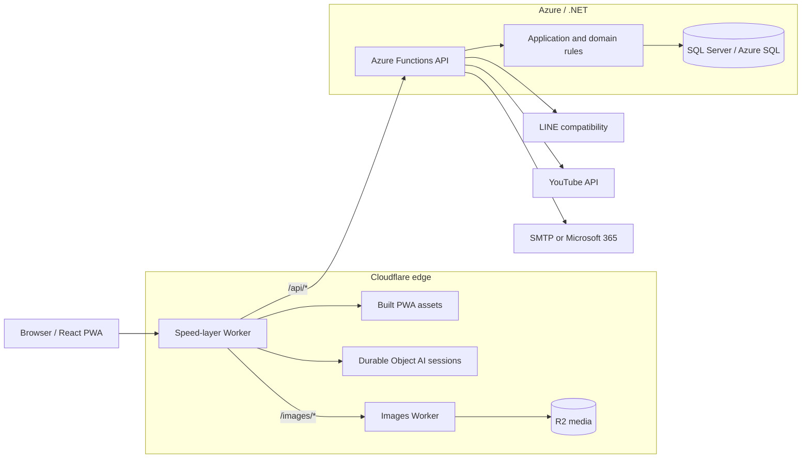

# ALIFE

ALIFE is an alpha-stage bilingual community platform for overseas Chinese Christian churches and groups. It connects public church content, member identity, group life, content publishing, sermons, Events, responsibilities, and AI-assisted work without collapsing their different authorization and privacy boundaries.

> **Current-source statement:** this README describes the repository at `main` as reviewed on 17 September 2026. It documents implemented source, not production availability, live-provider reliability, migration state, or user adoption.

[Open the project overview](https://ccalc.live/project/) · [Read the system architecture](docs/architecture.md) · [Read the Event overview](docs/events/README.md) · [Read the engineering retrospective](docs/project-retrospective.en.md)

## What ALIFE Is Today

ALIFE now has three connected product surfaces:

- **Public Church Life** — public pages, articles, visit/contact entry, sermons, public Events, and reviewed content.
- **Member Church Life and Group Life** — protected church content, group membership, announcements, albums, forums, contacts, notifications, Sunday bulletins, Bible-reading progress, and personal work.
- **Leader and ministry workspaces** — membership decisions, bilingual page publishing, Event creation and preparation, role acceptance, tasks, registration work, rosters, RAM, safeguarding, venues, transport, reports, and approval.

The product is intentionally not a single public CMS or a generic workflow engine. Public publishing, group collaboration, identity, Event governance, private operational records, and temporary AI sessions retain separate authority and storage rules.

## Runtime Architecture



| Boundary | Current responsibility | Must not own |
|---|---|---|
| React PWA | Bilingual experience, routing, local query coordination, WebAuthn browser ceremonies, working UI state | Final authorization, approval, or publication authority |
| Cloudflare speed layer | PWA assets, API/image routing, public and authorization-aware edge caching, ETags, cache invalidation, temporary AI sessions | Durable business truth or unrestricted private caching |
| .NET API | Authentication, current role/ownership checks, commands and queries, lifecycle gates, audit and integration orchestration | Browser-only trust or AI-made authority decisions |
| SQL Server | Members, groups, publishing records, Events, versioned evidence, operational and audit records | Public object delivery |
| Images Worker + R2 | Public and protected media access, upload, deletion, streaming, short-lived private access | Group authorization policy or business workflow |

The backend follows a layered structure:

```text
Alife.Domain          entities, enums, domain state
      ↓
Alife.Application     commands, queries, DTOs, interfaces, use-case rules
      ↓
Alife.Infrastructure  EF Core, SQL, caches, security and provider integrations
      ↓
Alife.Api             Azure Functions host, controllers and HTTP pipeline
```

`Alife.DbMigrator` owns migration and seed execution. The API is an ASP.NET Core controller application hosted by Azure Functions v4 isolated worker, not a set of unrelated function scripts.

## Current Capability Map

### Identity and access

- Discoverable **Passkeys are the primary authenticator**. ALIFE stores public credential material, not device PINs or biometrics.
- The JWT is carried in the HttpOnly `alife_auth` cookie. Minimal claims identify authentication method, authentication time, and session kind.
- Membership and role authorization is resolved from current server data; stale JWT role claims do not grant access.
- Activation, invitations, public church applications, group QR applications, browser continuation, and Passkey recovery have separate, auditable flows.
- Secret-bearing activation and application URLs keep their secret in the URL fragment, exchange it in a request body, and persist only a keyed hash.
- **LINE Login remains a compatibility route**, not the centre of the identity model.
- Configuration-gated internal Alpha sessions exist for controlled testing. Ordinary Alpha sessions are not strong authentication.
- Email delivery can use SMTP/STARTTLS or Microsoft 365 Graph. Manual phone-message delivery remains an explicit leader action where configured.

See [Identity Access](docs/identity-access.md) for the full contract and rollout boundaries.

### Church, groups, and community

- Hierarchical church and group structure with public, protected, and private access.
- Membership requests, invitations, approval/rejection, subgroup creation, leader/co-leader responsibilities, and group closure workflows.
- Church Life and Group Life reading and management surfaces.
- Announcements, albums, forums and sermon discussions, contact profiles/inquiries, notifications, visitor contact requests, and personal tasks.
- YouTube-backed sermons with normalized topic, speaker, sermon date, and administrative synchronization.
- Member-only Sunday bulletins with signed PDF access and manager-controlled replacement.
- Bible-reading progress and bilingual UI/content fallbacks.

### Bilingual content and publishing

Content remains group-owned and uses structured, bilingual data rather than whole-page HTML.

```json
{
  "en": "English content",
  "zh": "中文内容"
}
```

A public Page has three separate lifecycles:

```text
group working copy  →  submitted review copy  →  approved published snapshot
       editable              reviewable                  public/cacheable
```

- Editors build typed Sections, links, media, bilingual metadata, and rich content in the working copy.
- Submission creates an isolated review copy.
- Reviewers may revise, approve, or return that copy without mutating the group working page.
- A returned or newer pending submission does not remove the last approved public snapshot.
- Visibility withdrawal, deletion, or a later approval changes the public projection explicitly.
- Optimistic concurrency prevents simultaneous submit/review operations from silently overwriting each other.

### Event Management

The active Event model is capability-oriented:

```text
Event Plan
  = confirmed facts
  + structural units
  + capability modules
  + governance rules
  + attributable human decisions
```

- Human acceptance creates an immutable, versioned Event Plan snapshot.
- `EventSeries` stores recurrence and maintains a rolling occurrence window.
- `EventOccurrence` represents one actual delivery with occurrence-specific people, arrangements, exceptions, and execution confirmation.
- Roles are explicit assignments with scope and acceptance; titles and group membership alone do not grant module authority.
- Event Package Approval binds decisions to a canonical source-version vector. Plan acceptance, specialist review, Package approval, publication, registration opening, payment/fee acceptance, and execution are separate decisions.
- The original `GroupEvent` root and version-0 behavior remain readable while version-1 collaboration and module records are added alongside them.
- The former generic workflow/template/artifact engine is retired from the active product. Dedicated Event services and workspaces own current behavior.

Current module delivery is deliberately explicit:

| Status | Capability modules | Supported boundary |
|---|---|---|
| Current | `TEAM.WORK` | Owners, roles, activities, tasks, dependencies, acceptance, updates, and task review |
| Current | `PEOPLE.REGISTRATION` | Legacy enrollment plus version-1 participants, households/proxies/guardians, invitations, reservations, capacity and FIFO handling |
| Current | `SERVICE.ROSTER` | Candidate groups, occurrence slots, atomic batches, responses, replacements, defaults, and rolling extension |
| Current | `SAFETY.RAM` | Versioned policy, assessment, confirmation, independent review, source synchronization, owner review, history and printing |
| Current | `SAFEGUARDING.CHILD` | Child/guardian/consent/collector records, worker eligibility, occurrence check-in/out, and minimum-disclosure duty access |
| Current | `PROGRAM.PRODUCTION` | Occurrence sessions/items, ordering, run-sheet printing, and planning report |
| Current | `PLACE.RESOURCE` | Venue catalogue, capacity, reservations/conflicts, and recurring room calendars |
| Current core | `MOVE.STAY` | Drivers, vehicles, journeys/stops, restricted manifests, capacity/readiness, and planning report |
| Partial | `COMMS.FOLLOWUP` | Bilingual content/posters, explicit publication, Event reviews, and report adoption; no delivery tracking |
| Partial | `MONEY.FINANCE` | Version-1 fee rules, manual receipts/refunds, private audit and evidence; no provider payments or full ledger |
| Partial | `FOOD.HOSPITALITY` | Lead and report workflow; no operational menu, dietary, kitchen, vendor, or cleanup tooling |
| Unavailable / target | `FESTIVAL.OPERATIONS` | Structural definitions only; it cannot be enabled in version 1 |

Plan B and a fifth Review/Reflection stage are not current capabilities. The authoritative status and remaining gaps are in [Event implementation status](docs/events/IMPLEMENTATION-STATUS.md); business rules are in the [Event core contract](docs/events/EVENT-CONTRACT.md).

### AI assistance

The speed layer provides bounded AI assistance for Event details, task and registration forms, RAM guidance/candidates, enrollment/review sessions, bilingual text, and Event poster drafting.

AI may propose or translate candidate content. It may not confirm facts, assign authority, approve policy or Packages, mark readiness, publish content, or silently persist an Event Plan. Durable Object session state is temporary; accepted records are written through authorized backend APIs after explicit human action.

## Security, Privacy, and Cache Model

ALIFE treats authorization and caching as one design problem.

| Data class | Examples | Cache behavior |
|---|---|---|
| Public projection | Reviewed public pages, sermons, public upcoming Events | Shared edge cache is allowed with explicit keys, tags, TTLs, and invalidation |
| Group-shared | Group pages, subgroups, Events, members visible to the same authorized audience | Reuse only after current authorization and visibility checks |
| Role-restricted | Event teams, RAM, safeguarding, finance, approval evidence | Private and normally `no-store`; never shared across viewers |
| User-specific | `/api/me`, identity ceremonies, applications, personal tasks, notifications | `no-store`; excluded from service-worker API caching |

Additional safeguards include:

- server-side ownership, membership, role, purpose, version, and platform-permission checks;
- `401`/`403` API responses rather than frontend redirects pretending to enforce access;
- SQL-backed, HMAC-keyed rate limiting for anonymous identity paths;
- trusted-proxy filtering before accepting `CF-Connecting-IP`;
- private-data minimization in logs and AI prompts;
- ETag/`If-Match` concurrency for versioned state;
- cache invalidation after membership, visibility, publishing, sponsorship, Event, and protected-record changes;
- fail-closed behavior for unknown policy/module values and malformed public snapshots.

## Repository Layout

```text
backend/
  Alife.sln
  src/
    Alife.Domain/          Domain state
    Alife.Application/     Use cases and contracts
    Alife.Infrastructure/  EF Core, security, caches, integrations
    Alife.Api/             Azure Functions HTTP host
    Alife.DbMigrator/      Migrations and seed execution
  tests/Alife.Tests.Unit/
  docker-compose.yml       Local SQL Server 2022

cloudflare/
  alife-app/               React 19 bilingual PWA
  speed-layer/             Assets, API proxy, cache, AI sessions
  images-api/              R2-backed media Worker

docs/
  events/                  Event contracts, modules, status and history
  architecture.md          System architecture
  identity-access.md       Identity and recovery contract
  project-retrospective.*  Evidence-based engineering history

infra/terraform/           Cloudflare infrastructure definitions
scripts/                   Local development and repository utilities
alife-dev.cmd              Windows local-stack launcher
```

## Technology

| Area | Current stack |
|---|---|
| Frontend | React 19.2, TypeScript 5.9, Vite 7, React Router 7, Tailwind CSS, Framer Motion |
| Client data | TanStack Query, TanStack React DB, Axios, IndexedDB ETag storage |
| PWA | `vite-plugin-pwa`; runtime cache for assets/media, not API responses |
| Backend | .NET 10, Azure Functions v4 isolated worker, ASP.NET Core controllers, MediatR |
| Persistence | EF Core 10, SQL Server/Azure SQL, additive migrations |
| Backend cache | .NET HybridCache with explicit invalidation services |
| Edge | Cloudflare Workers, Cache API, KV-backed logical records, Durable Objects |
| Media | Separate Cloudflare Worker and R2 |
| Authentication | WebAuthn/Passkeys, HttpOnly JWT cookie, LINE compatibility |
| AI | Gemini through the speed layer, with temporary session and explicit human-adoption boundaries |

## Local Development

### Prerequisites

- Windows PowerShell
- .NET SDK 10.0.x
- Node.js 20+
- Docker Desktop
- Azure Functions Core Tools v4

Install the two JavaScript workspaces once:

```powershell
cd cloudflare/alife-app
npm install

cd ../speed-layer
npm install

cd ../..
```

For a fresh local database, provide the migrator connection string in the current shell or in ignored `backend/.env`:

```powershell
$env:ConnectionStrings__Default = 'Server=localhost,14333;Database=alife_db;User Id=sa;Password=AlifeDevPass123;TrustServerCertificate=True;Encrypt=False'
```

Start SQL Server, apply migrations/seeds, and launch the normal stack:

```powershell
.\alife-dev.cmd -ApplyMigrations
```

If the SQL Server container is already running and current:

```powershell
.\alife-dev.cmd -SkipSql
```

The launcher starts the API, images Worker, speed layer, and Vite app; scheduled Functions and Azurite are disabled for normal UI/API work.

| Service | Local URL |
|---|---|
| React/Vite | `http://localhost:5173` |
| Cloudflare speed layer | `http://localhost:8787` |
| Images Worker | `http://127.0.0.1:8788` |
| Azure Functions API | `http://127.0.0.1:7071` |
| Swagger UI | `http://127.0.0.1:7071/api/help` |

Useful launcher variants:

```powershell
.\alife-dev.cmd -SkipSql -ApplyMigrations
.\alife-dev.cmd -SkipSql -RebuildFrontendAssets
.\alife-dev.cmd -SkipSql -UseAzurite -EnableScheduledJobs
.\alife-dev.cmd -SkipSql -MobilePasskeyOrigin https://example.trycloudflare.com
```

`-MobilePasskeyOrigin` configures the backend RP ID/origin and Vite allowlist for a trusted HTTPS tunnel; it does not create the tunnel. Treat tunnel URLs as public.

Logs are written under `.local-dev/logs`.

### Optional local AI routes

Copy `cloudflare/speed-layer/.dev.vars.example` to `.dev.vars` and provide:

```env
GEMINI_API_KEY=...
CACHE_SYNC_API_TOKEN=...
```

Keep provider keys and deployment secrets out of source control.

## Configuration Groups

Use environment variables, Azure Function App settings, or ignored local configuration. Important groups are:

- `ConnectionStrings__Default`
- `Jwt__Issuer`, `Jwt__Audience`, `Jwt__Key`, `Jwt__KeyId`
- `Passkeys__Enabled`, `Passkeys__RpId`, `Passkeys__RpName`, `Passkeys__Origins__*`
- `TokenProtection__SigningKey`, `RateLimiting__HashKey`, `TrustedProxyNetworks__*`
- `LineLogin__*`, `Frontend__BaseUrl`
- `IdentityEmail__*`, `AdministratorActivation__*`, `AlphaLogin__*`
- `FileAssets__*`
- `Cloudflare__*`
- `YOUTUBE_API_KEY`, `YOUTUBE_PLAYLIST_ID`
- Worker secrets `GEMINI_API_KEY` and `CACHE_SYNC_API_TOKEN`

The tracked [backend environment example](backend/.env.example) documents identity/provider options. Do not copy placeholder secrets into a deployed environment.

## Verification Commands

Run checks proportional to the change:

```powershell
# Backend
dotnet build backend/Alife.sln --nologo
dotnet test backend/Alife.sln --no-restore --nologo

# Frontend
cd cloudflare/alife-app
npm run typecheck
npm run test:identity
npm run test:event-composition
npm run build

# Speed layer
cd ../speed-layer
npm test
```

SQL-backed concurrency/migration tests are opt-in and must target only an approved disposable local database. Provider fixtures and unit tests do not prove live LINE, email, Gemini, YouTube, browser/device, deployment, or shared-database behavior.

## Documentation Map

| Topic | Authoritative entry |
|---|---|
| System boundaries | [Architecture](docs/architecture.md) |
| Frontend | [Frontend architecture](docs/frontend_architecture.md) |
| Edge/cache | [Speed-layer architecture](docs/speed-layer_architecture.md) |
| PWA behavior | [PWA](docs/pwa.md) |
| Identity/onboarding/recovery | [Identity Access](docs/identity-access.md) |
| Church Life | [Church Life site](docs/church-life-site.md) |
| Group Life | [Group Life site](docs/group-life-site.md) |
| Event product overview | [Event README](docs/events/README.md) |
| Event business rules | [Event core contract](docs/events/EVENT-CONTRACT.md) |
| Event delivery boundary | [Event implementation status](docs/events/IMPLEMENTATION-STATUS.md) |
| Engineering history | [Retrospective](docs/project-retrospective.en.md) and [verification audit](docs/project-retrospective-verification.md) |

## Maturity and Known Boundaries

ALIFE is a broad, test-covered alpha codebase. The repository demonstrates implemented workflows and deliberate architecture, but it does not by itself prove:

- production SLOs or operational support readiness;
- that the latest migrations are applied to a shared environment;
- live success across all Passkey/browser/device combinations;
- live behavior of LINE, email, Gemini, YouTube, or storage providers;
- completion of partial Event modules;
- real-user task completion, adoption, or ministry outcomes.

Keep those claims separate from source-level capability. For how the architecture reached its current form, see the [evidence-based retrospective](docs/project-retrospective.en.md).
