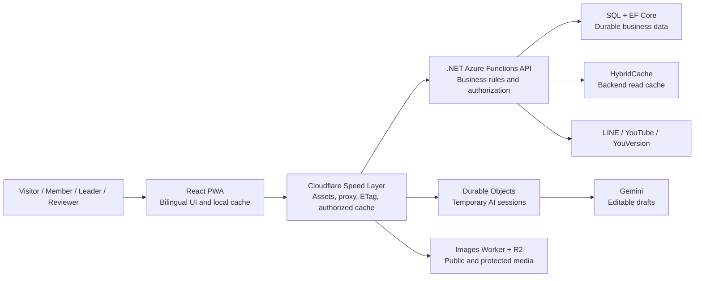

# Alife: From a Real Community Problem to a Useful Alpha Product

> A bilingual church community platform that I led from foundation through continuous product iteration for visitors, members, group leaders, content reviewers, and platform administrators.

*Alife public website homepage, 25 July 2026. The public experience and authenticated group workspace share one product and content system.*

## At a glance

| Scope | Verifiable evidence |
|---|---|
| Zero-to-one period | 15 April to 23 July 2026: 100 days |
| Delivery trail | 272 GitHub issues, 270 closed, two open |
| Primary users | Visitors, members, leaders/co-leaders, page reviewers, platform administrators |
| Product scope | Groups and members, bilingual CMS, sermons, events, enrollment, forum, announcements, albums, contacts, archive, Bible reading |
| Technical scope | React PWA, .NET Azure Functions, SQL, Cloudflare Workers, R2, Durable Objects, multi-layer caching |

Issue volume demonstrates delivery scope and traceability, not user adoption. Alife is currently an alpha product with complete workflows; the next stage is to validate the beta through real usage metrics.

## The problem

In overseas Chinese churches, groups, members, web pages, sermons, events, and bilingual content are often fragmented across unrelated tools. Visitors struggle to find an entry point, members struggle to remain engaged, leaders depend on chat history and personal knowledge, and a few technical volunteers become the bottleneck for website updates.

I reframed this as one continuous journey across five roles:

**Visitor discovers the church → member joins a group → leader manages people and events → volunteer builds bilingual content → reviewer safely publishes it to the public website.**

## What I built

- **Member experience:** LINE sign-in, group discovery and joining, event enrollment, notifications, sermon discussion, and bilingual Bible reading.
- **Leader workspace:** Membership approval, roles, subgroups, announcements, contacts, albums, pages, and events.
- **Bilingual website builder:** WYSIWYG sections, media library, autosave, language guardrails, page presets, and legacy-content migration.
- **Content governance:** Publication review, return reasons, bilingual navigation, homepage placement, and anonymous-safe projections.
- **AI event assistant:** Planning, enrollment, review, translation, and RAM risk assessment; AI drafts require human confirmation, and unapproved events cannot accept enrollment.

## How the product grew

1. **Trustworthy foundation:** PWA, LINE OAuth, HttpOnly JWT, a separated API, and deployable backend ([#5](https://github.com/appccalc-developers/Alife/issues/5), [#9](https://github.com/appccalc-developers/Alife/issues/9), [#13](https://github.com/appccalc-developers/Alife/issues/13)).
2. **Usable group product:** A mobile-first shell, separate member/leader modes, and group-centered content navigation ([#25](https://github.com/appccalc-developers/Alife/issues/25), [#29](https://github.com/appccalc-developers/Alife/issues/29)).
3. **Complete business workflows:** Page building, event enrollment and review, membership approval, notifications, and public content ([#117](https://github.com/appccalc-developers/Alife/issues/117), [#174](https://github.com/appccalc-developers/Alife/issues/174), [#255](https://github.com/appccalc-developers/Alife/issues/255)).
4. **Alpha governance:** Publication review, platform permissions, secure edge caching, diagnostics, and event-risk approval ([#419](https://github.com/appccalc-developers/Alife/issues/419), [#553](https://github.com/appccalc-developers/Alife/issues/553), [#565](https://github.com/appccalc-developers/Alife/issues/565)).

## Architecture

The boundaries are deliberate: identity and authorization belong to the backend; shared acceleration belongs to the edge; media belongs to a separate Worker and R2; AI stores temporary session state, while only user-approved results enter durable business data.

## Product evidence

| Platform operations workspace | Public website building and review |
|---|---|
|  |  |
| Users, notices, tasks, and audit activity in one operational surface. | Bilingual menus, page order, review status, and homepage content placement. |

| WYSIWYG page editor | AI event assistant |
|---|---|
|  |  |
| Section content, layout, and publishing guidance over the real page presentation. | Shared facts across the event notice and RAM, with explicit human confirmation for safety facts. |

| Bilingual RAM risk assessment |
|---|
|  |
| An editable AI-assisted draft with visible risk state and submission readiness. |

## Three decisions that best demonstrate my contribution

1. **I changed the domain model to fit the user task.** I retired global page ownership and replaced it with group-owned content plus a separate reviewed public projection.
2. **I did not “solve” cache bugs by disabling caching.** I classified public, group-shared, member-specific, and browser-local data, then fixed authorization order, pagination keys, and cross-PoP invalidation.
3. **I kept AI behind human accountability.** AI may draft a bilingual RAM, but it cannot invent safety facts; leader confirmation and auditor approval are enforced server-side.

## Outcome and next step

Alife grew from a basic API and PWA into an explainable, deployable, diagnosable alpha product that supports complete role-based workflows. It demonstrates my ability to connect product judgment, user experience, full-stack implementation, cloud architecture, security boundaries, and continuous iteration into one coherent result.

The next step is not more feature volume. It is a structured alpha trial with one or two real church groups, measuring completion time, failure points, and repeat usage for page creation, announcements, and event planning, then using that evidence to define the beta.

Detailed evidence: [Full English retrospective](project-retrospective.en.md) · [中文版完整回溯](project-retrospective.zh-CN.md)
