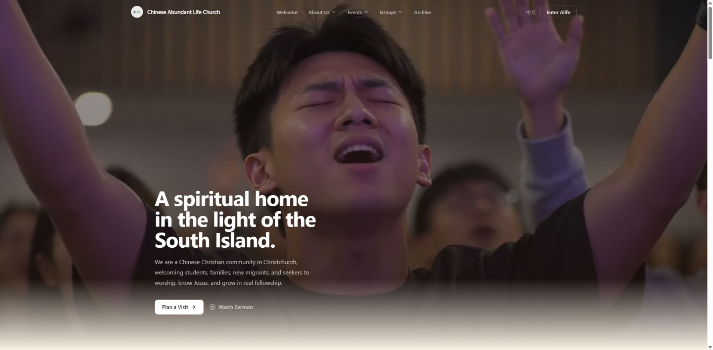
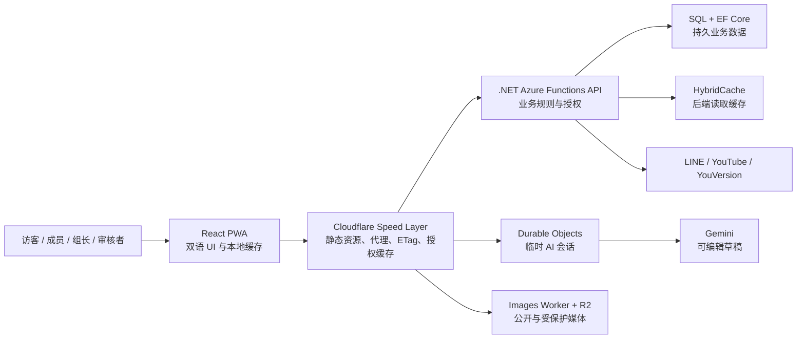
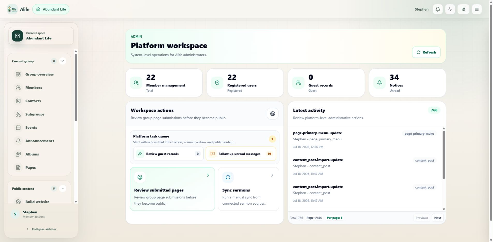
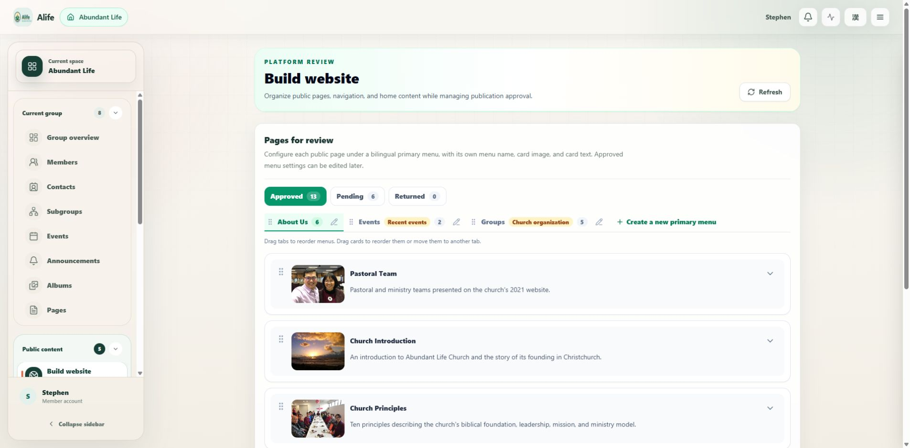
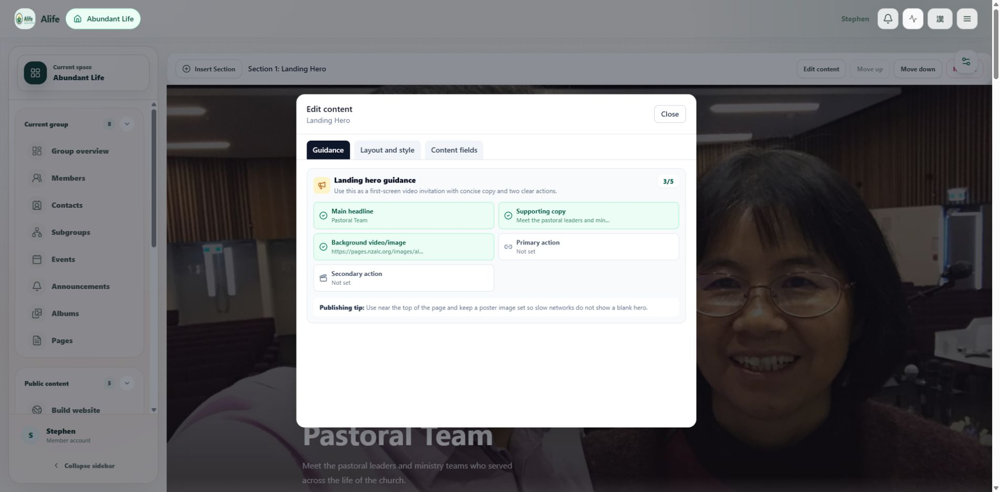
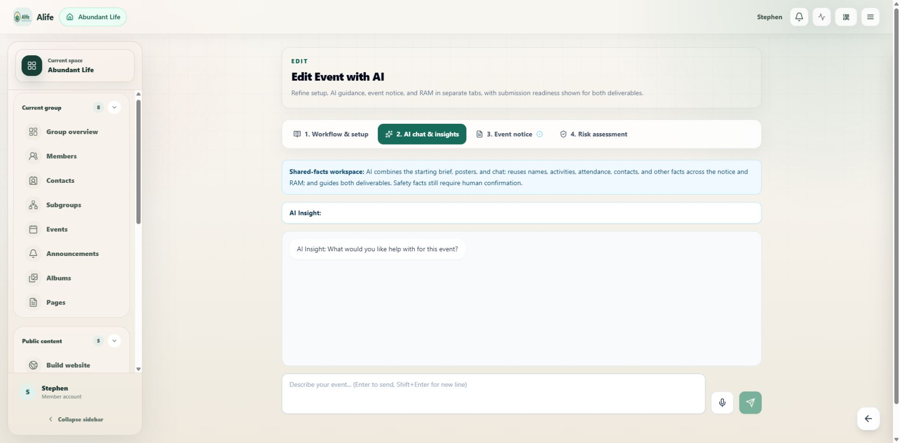
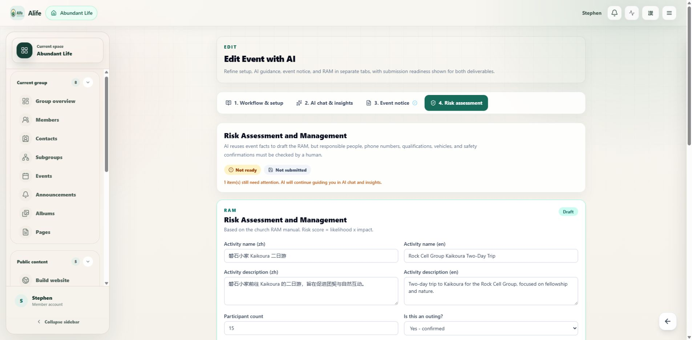

# Alife：从真实社区问题到可用 Alpha 产品

> 我主导建立并持续迭代的双语教会社区平台，服务访客、成员、组长、内容审核者与平台管理员。

*Alife 公开网站首页，2026-07-25。公开体验与登录后的群组工作空间共用同一产品和内容体系。*

## 项目速览

| 范围 | 可验证证据 |
|---|---|
| 0→1 周期 | 2026-04-15 至 2026-07-23，共 100 天 |
| 交付轨迹 | 272 条 GitHub issues，270 条已关闭，2 条开放 |
| 主要用户 | 访客、成员、组长/副组长、页面审核者、平台管理员 |
| 产品能力 | 群组与成员、双语 CMS、讲道、活动、报名、论坛、公告、相册、联系人、历史文章、圣经阅读 |
| 技术范围 | React PWA、.NET Azure Functions、SQL、Cloudflare Workers、R2、Durable Objects、多层缓存 |

Issue 数量用于证明工作范围和可追溯性，不代表用户采用率。Alife 当前定位是具备完整工作流的 Alpha 产品，下一阶段才是用真实使用指标验证 Beta。

## 问题

海外华人教会的群组、成员、网页、讲道、活动和双语内容通常分散在多个工具中。访客难以找到入口，成员难以持续参与，组长依赖聊天记录和个人经验管理工作，少数技术人员则成为网站更新瓶颈。

我把问题重新定义为五个角色的连续旅程：

**访客发现教会 → 成员加入群组 → 组长管理人和活动 → 内容同工建立双语页面 → 审核者安全发布到公开网站。**

## 我建立的产品

- **成员体验：** LINE 登录、群组发现与加入、活动报名、通知、讲道讨论、双语圣经阅读。
- **组长工作空间：** 成员审批、角色管理、子群组、公告、联系人、相册、网页和活动。
- **双语网站构建器：** WYSIWYG section 编辑、媒体库、自动保存、语言防错、页面预设与旧内容迁移。
- **内容治理：** 页面审核、退回理由、双语菜单、首页投放以及公开安全投影。
- **AI 活动助手：** 活动策划、报名、复盘、翻译和 RAM 风险评估；AI 草稿必须经过人确认，未批准活动不能开放报名。

## 产品如何成长

1. **可信赖的底座：** PWA、LINE OAuth、HttpOnly JWT、独立 API 与可部署后端（[#5](https://github.com/appccalc-developers/Alife/issues/5)、[#9](https://github.com/appccalc-developers/Alife/issues/9)、[#13](https://github.com/appccalc-developers/Alife/issues/13)）。
2. **可使用的群组产品：** 移动优先应用外壳、成员/组长分离的工作模式和群组内容入口（[#25](https://github.com/appccalc-developers/Alife/issues/25)、[#29](https://github.com/appccalc-developers/Alife/issues/29)）。
3. **完整业务工作流：** 页面构建、活动报名与复盘、成员审批、通知和公开内容（[#117](https://github.com/appccalc-developers/Alife/issues/117)、[#174](https://github.com/appccalc-developers/Alife/issues/174)、[#255](https://github.com/appccalc-developers/Alife/issues/255)）。
4. **Alpha 产品治理：** 发布审核、平台权限、边缘缓存安全、诊断和活动风险审批（[#419](https://github.com/appccalc-developers/Alife/issues/419)、[#553](https://github.com/appccalc-developers/Alife/issues/553)、[#565](https://github.com/appccalc-developers/Alife/issues/565)）。

## 架构

关键边界是：身份和授权由后端负责；共享加速由边缘层负责；媒体由独立 Worker/R2 负责；AI 只保存临时会话，经过用户确认的结果才进入持久业务数据。

## 产品界面证据

| 平台运营工作空间 | 公开网站构建与审核 |
|---|---|
|  |  |
| 统一呈现用户、通知、待办和审计活动。 | 管理双语菜单、页面顺序、审核状态和首页内容。 |

| WYSIWYG 页面编辑器 | AI 活动助手 |
|---|---|
|  |  |
| 在真实页面画面上编辑 section 内容、布局与发布指引。 | 在活动公告与 RAM 之间复用事实，同时明确要求人工确认安全信息。 |

| 双语 RAM 风险评估 |
|---|
|  |
| AI 辅助生成可编辑草稿，风险状态和提交就绪度清晰可见。 |

## 最能证明我的三个决定

1. **为用户任务修改领域模型。** 我取消了容易造成双重所有权的全局页面，改为群组拥有内容、审核记录控制公开投影。
2. **没有用“关闭缓存”解决缓存问题。** 我按公开、群组共享、成员专属和浏览器本地数据重新分层，并修复授权顺序、分页键和跨 PoP 失效。
3. **没有让 AI 越过责任边界。** AI 可以生成双语 RAM 草稿，但不能编造安全事实；组长确认和审核者批准由服务端强制执行。

## 结果与下一步

Alife 已从基础 API/PWA 成长为一个可解释、可部署、可诊断并能支持真实角色工作流的 Alpha 产品。它证明我能够把产品判断、用户体验、全栈实现、云端架构、安全边界和持续迭代连接成一个完整结果。

下一步不是继续增加功能数量，而是与一至两个真实教会小组开展结构化 Alpha 试用，测量建页、发布公告和建立活动的完成时间、失败点与重复使用率，再用数据决定 Beta 范围。

详细证据：[完整中文版回溯](project-retrospective.zh-CN.md) · [English retrospective](project-retrospective.en.md)
