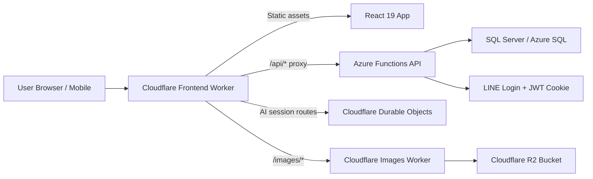

# Alife Technical Slices

A concise technical overview for prospective maintainers, ICT students, and lecturers.

This document is intentionally written as an orienting guide rather than as a full technical specification. Its purpose is to help first-time readers understand several key slices of the system: how it is structured, why that structure was chosen, what responsibilities belong to each layer, and what knowledge is required to maintain or extend it.

## 0. A one-sentence summary

Alife is a full-stack application designed for a church context. Its backend runs on Azure Functions, its frontend is a React 19 + TypeScript + Vite progressive web application (PWA), and its edge layer uses Cloudflare Workers for frontend hosting, API proxying, image delivery, and selected AI session workflows.

For ICT students, Alife can be understood as a representative example of a contemporary web system:

- it employs a layered backend architecture;
- it separates frontend and backend responsibilities;
- it exposes cloud-hosted APIs;
- it uses an edge proxy layer;
- it provides image services through object storage;
- it supports mobile-friendly web application usage;
- and it already exhibits the security, caching, deployment, CORS, and maintainability concerns typical of real-world systems.

## 1. System overview



At the highest level:

- the frontend application is responsible for presentation and user interaction;
- the Azure backend is responsible for business logic, persistence, and authorization;
- the Cloudflare layer provides the edge entry point, routing, proxying, image delivery, and selected session-oriented capabilities.

## 2. Slice A: The role of the Backend layer

### What the Backend is

The backend is an Azure Functions application written in .NET 10 and organised using a Clean Architecture-inspired layered structure.

The project is broadly divided as follows:

```text
Alife.Domain         Domain models, entities, enums
Alife.Application    Use cases, commands, queries, DTOs, business rules
Alife.Infrastructure EF Core, persistence, external services, security, caching
Alife.Api            Azure Functions host layer, HTTP controllers
Alife.DbMigrator     Database migration and seed utility
```

### Why the Backend is structured this way

This separation is not merely stylistic. It is intended to improve maintainability and reduce coupling so that future changes are less likely to have system-wide side effects.

- `Domain` is kept as independent as possible from infrastructure and frameworks.
- `Application` defines what the system does in terms of use cases.
- `Infrastructure` implements how persistence, OAuth, caching, and other integrations work.
- `Api` receives HTTP requests and adapts them into application-layer operations.

For teaching purposes, this is a clear example of layered architecture together with controlled dependency direction.

### Technologies used in the Backend

- .NET SDK 10.0.100
- Azure Functions v4 isolated worker
- ASP.NET Core HTTP integration
- Entity Framework Core 10
- SQL Server
- Swashbuckle / Swagger
- HybridCache

### Notable technical characteristics of the Backend

#### 1. Azure Functions is used as a host for a structured API system

Although the backend runs on Azure Functions, it is not simply a collection of isolated function scripts. It incorporates ASP.NET Core controller-style APIs, dependency injection, authentication, Swagger, and application-layer orchestration.

This is pedagogically useful because it shows how a serverless runtime can host a comparatively complete API architecture.

#### 2. JWT authentication is implemented through HttpOnly cookies

A particularly instructive design choice is that JWTs are stored in HttpOnly cookies rather than in frontend local storage.

- Cookies are automatically sent by the browser.
- `HttpOnly` reduces the risk of direct token access through client-side scripts.
- Authorization is not fully encoded into the token; current permissions are resolved on the server against current data.

This creates opportunities to discuss XSS risk, claims minimisation, and permission consistency.

#### 3. Read and write concerns are separated in a CQRS-like manner

The project is not a full CQRS platform, but commands and queries are clearly distinguished. This is useful because it demonstrates that:

- read paths and write paths often optimise for different concerns;
- DTOs, authorization checks, and cache invalidation have different roles in different workflows;
- real systems often outgrow the “single large service class” approach.

#### 4. Caching is applied strategically

The system uses `.NET 10 HybridCache`, primarily on read-heavy paths such as member data, pages, groups, events, and sermons.

This reflects a realistic engineering concern: once a system becomes content-heavy and read-dominant, effective caching and invalidation strategies matter as much as basic CRUD correctness.

### Recommended knowledge for Backend maintainers

A maintainer of this layer should ideally be comfortable with:

- C# and .NET fundamentals
- HTTP API design
- EF Core and SQL basics
- authentication and authorization concepts
- dependency injection and layered architecture
- tracing call flow from controller to application to infrastructure

## 3. Slice B: Cloudflare as an architectural layer, not merely a hosting tool

This is one of the most instructive parts of the project for ICT students and lecturers because it reflects current edge-oriented system design.

### The Cloudflare layer consists of two main parts

#### 1. Frontend Worker

The `wrangler.jsonc` in the frontend directory indicates that this Worker does considerably more than serve static files. It is responsible for:

- hosting SPA static assets
- providing the `/api/*` proxy entry point
- exposing the `/images/*` edge route
- dispatching AI session routes
- binding Durable Objects
- binding a KV namespace

Thus, from the browser’s perspective, the system presents a single entry point, while internally routing requests to multiple services.

#### 2. Images API Worker

`cloudflare/images-api` is a separate Worker dedicated to image services. It binds directly to a Cloudflare R2 bucket and supports:

- listing images and subfolders
- uploading images
- deleting images or folders
- reading image objects by path

An important clarification is that R2 is used here specifically for image object storage, not as a general-purpose store for the application’s main business data.

### Understanding DNS, proxying, and Workers together

The simplest interpretation is:

- Cloudflare DNS directs domain traffic into Cloudflare;
- a Cloudflare Worker receives the incoming request;
- the Worker decides whether to return static content, proxy an API request, route an AI session, or forward to the image service.

For students, this provides a useful example of reverse proxying, edge routing, and multi-service entry-point aggregation.

### Notable technical characteristics of the Cloudflare layer

#### 1. The Worker functions as both hosting and routing infrastructure

In this system, the Worker is not a minor deployment convenience. It is part of the architecture itself. It unifies the browser-facing entry and reduces the need for the frontend to deal directly with multiple origins.

#### 2. Durable Objects support AI session flows

The frontend Worker binds several Durable Object classes to support workflows such as event planning, registration, and review.

This is significant because it moves the system beyond simple CRUD patterns into the design of stateful interaction flows.

This provides a basis for discussing:

- when Durable Objects are appropriate;
- why some session state belongs at the edge rather than in the client;
- how transient session state and persistent backend data should be separated.

#### 3. KV can support lightweight edge-state scenarios

The KV namespace binding suggests that not all edge decisions require immediate origin access. Cloudflare KV can support lightweight caching or auxiliary authorization-related lookups.

#### 4. R2 helps decouple image delivery from the main API

Using R2 with a dedicated image Worker offers several clear benefits:

- image management does not need to be embedded in the main business API;
- images can follow their own path and domain conventions;
- caching, transformation, and access-control logic can be evolved independently.

### Recommended knowledge for Cloudflare maintainers

A maintainer of this layer should ideally understand:

- Cloudflare Worker fundamentals
- Wrangler configuration and deployment
- routing and reverse proxy concepts
- the differences among KV, Durable Objects, and R2
- browser networking concepts such as CORS, cookies, origin, and domain

## 4. Slice C: The Frontend App as an application layer, not only a set of pages

### What the Frontend is

The frontend is a React 19 + TypeScript + Vite PWA. Styling is handled with Tailwind CSS, HTTP communication uses Axios, and data flow is built around TanStack Query and TanStack React DB.

TanStack is particularly important in this project. It is not merely a convenience layer for fetching data. It serves as a key part of the frontend data architecture in two major ways:

- it provides client-side caching and persists selected read results into browser storage, improving repeat-entry and weak-network behaviour;
- it acts as the data-source layer for intelligent list sections such as `ListView` and `GroupList`, allowing these sections to remain declarative rather than implementing ad hoc fetching logic.

Accordingly, the frontend should be viewed as a substantive web application rather than a static website.

### Why React 19 + Vite

React 19 provides the component and interaction model, while Vite provides the development and bundling toolchain. This combination is common in current frontend practice because it offers:

- fast local startup
- strong TypeScript integration
- clean frontend/backend separation
- a relevant platform for learning modern frontend engineering

### Responsibilities of the Frontend in this project

The frontend is responsible for:

- routing and page entry composition
- post-login user-state initialisation
- group pages and administrative pages
- page and section editing interfaces
- UI flows for events, registration, and review
- mobile-friendly browsing
- PWA installation and cache-related user experience

### Notable technical characteristics of the Frontend

#### 1. The frontend operates as a full App Shell

React is not used merely to assemble a few pages. The application includes an App Shell, providers, a route tree, group context, and data services.

This is important in teaching because real systems must address:

- global authentication state
- route changes
- data refresh behaviour
- error handling
- role-specific navigation and access patterns

#### 1.5. TanStack serves as the frontend data foundation

Within this project, TanStack functions as a local-first data layer rather than only as a remote-fetch helper. It brings together several concerns that are often fragmented in production systems:

- query caching
- data reuse on re-entry
- local collection querying
- IndexedDB-backed offline or weak-network reads
- shared data sources across multiple pages or sections

More specifically, the project combines `TanStack Query + TanStack DB + idb-keyval`:

- `TanStack Query` manages query coordination and invalidation;
- `TanStack React DB` organises data into subscribable collections;
- `idb-keyval` stores ETagged HTTP results in browser IndexedDB.

Its architectural value lies in unifying caching, reuse, local access, and list-driven presentation into a single pattern.

#### 2. Page content follows a CMS-like section model

Pages are not stored as monolithic HTML strings. Instead, they are composed of structured sections.

This is relevant because it introduces students to:

- content modelling
- page editor design
- separation between rendering logic and content structure
- bilingual titles, summaries, and visibility settings

`ListView` is a particularly good example. It appears visually as a standard content block, but the underlying metadata determines whether it should display sermons, subgroups, members, pages, or events. A unified data resolution layer then retrieves the relevant dataset.

Thus, `ListView` / `GroupList` represents a point where the content model and the frontend data architecture intersect.

#### 3. Authentication is handled in a realistic browser-integrated manner

Axios is configured with `withCredentials: true`, meaning the frontend relies on the browser’s cookie mechanism instead of manually storing and attaching tokens.

This helps illustrate that, in real systems, authentication is often a coordinated concern involving cookies, CORS, browser behaviour, and backend middleware.

#### 4. The PWA model supports installable, mobile-friendly usage

This is especially practical in the church context, where users may be willing to install a web app shortcut without adopting a fully native application.

The PWA experience here is not driven only by the service worker. The TanStack-based local data layer also improves continuity by retaining previously viewed data in browser storage and local collections.

#### 5. TanStack also underpins `ListView` / `GroupList`

If the project is used for teaching, this mechanism is especially worth studying.

A section such as `GroupListSection` does not directly fetch its own data. Instead, it passes metadata to `useListSourceResolver`, which maps the source type to the appropriate TanStack collection, such as:

- sermons collection
- subgroups collection
- group memberships collection
- group pages collection
- group events collection

The resolver then applies a consistent sequence of operations:

- local-first reads
- conditional API fetching
- filtering and sorting
- limiting the result set
- passing the final result to the UI for rendering

This makes `ListView` a genuinely reusable content block: editors configure metadata, while developers maintain a single coherent data-source layer.

### Recommended knowledge for Frontend maintainers

A maintainer of this layer should ideally understand:

- TypeScript fundamentals
- React components, state, effects, and context
- React Router
- TanStack Query / TanStack React DB basics
- HTTP / REST / Axios fundamentals
- HTML, CSS, and Tailwind CSS
- browser cache, IndexedDB, and offline-read concepts
- the role of build, preview, and deployment scripts

## 5. Slice D: The intersection of data, permissions, and content

To understand the system fully, it is not sufficient to study the frontend, backend, and cloud layers in isolation. It is also necessary to examine how business data moves across the entire system.

### Example flow: a user opens the application

1. The browser enters through the Cloudflare frontend entry point.
2. The Worker returns the static assets and frontend application.
3. After startup, the application calls `/api/me`.
4. The request is proxied by the Worker to Azure Functions.
5. The backend reads the JWT from the HttpOnly cookie and resolves the current member.
6. The backend determines visible data based on database relationships and permission rules.
7. The frontend uses the result to determine navigation, visible pages, and editable scope.

### Example flow: a user browses images

1. The frontend requests `/images/*` or another image-related URL.
2. The Cloudflare image Worker receives the request.
3. The Worker reads the image object or lists the relevant path from R2.
4. The response is returned to the frontend.

### Example flow: an AI-assisted event session

1. The frontend sends user input to `/api/events/session/*` or a related route.
2. The Cloudflare Worker dispatches the request to the appropriate Durable Object.
3. The Durable Object maintains the session state.
4. When the workflow is complete, the result is submitted to the backend REST API for persistence.

These examples are useful pedagogically because they connect browser, edge, API, database, and session-state responsibilities in one end-to-end path.

## 6. Local development requirements

To enable students or future maintainers to run the system locally, the following tools are recommended:

- .NET SDK 10.0.x
- Node.js 20+
- Docker Desktop
- Wrangler CLI
- a SQL Server container environment
- basic Git proficiency

### Minimal local workflow

#### Backend

```powershell
cd backend
docker compose up -d sqlserver
dotnet run --project src/Alife.DbMigrator
dotnet run --project src/Alife.Api
```

#### Frontend

```powershell
cd frontend/alife-app
npm install
npm run dev
```

#### Build verification only

```powershell
dotnet build backend/Alife.sln -c Debug
cd frontend/alife-app
npm run build
```

### A realistic note on the current project state

Based on the current repository state:

- the backend build passes;
- the frontend build passes;
- some unit tests are currently blocked by older test files because controller constructors have changed.

This is, in fact, representative of real software projects: the system can be operational while test maintenance debt remains unresolved.

## 7. A skills progression map for ICT students

This project supports different levels of participation.

### Level 1: Able to understand and run the system

Suitable for students who are beginning to work with modern web applications.

Recommended abilities:

- basic Git usage
- running `dotnet build` and `npm run build`
- reading README files and environment-variable settings
- identifying the frontend, backend, and database parts of the system

### Level 2: Able to modify a feature slice

Suitable for students with foundational web development experience.

Recommended abilities:

- confidence in either C# or TypeScript
- modifying an API endpoint or frontend form
- reading basic SQL / EF Core logic
- tracing a feature path from UI -> API -> DB

### Level 3: Able to maintain a module

Suitable for capstone students, teaching assistants, or future maintainers.

Recommended abilities:

- understanding layered architecture
- debugging authentication and authorization issues
- working with Cloudflare Worker and Azure Functions configuration
- handling cross-layer concerns such as caching, edge routing, session state, and image delivery

## 8. Teaching entry points for lecturers

If Alife is used as a teaching case, the following are strong points of entry:

1. How Clean Architecture is applied in a real system rather than only in diagrams.
2. How Azure Functions can host a relatively complete API platform.
3. How a React application integrates with cookie-based authentication.
4. How a Cloudflare Worker can combine static hosting, proxying, and edge logic.
5. What kinds of problems are well suited to R2, KV, and Durable Objects respectively.
6. Why real systems inevitably involve build, test, deployment, caching, and CORS concerns.

## 9. Recommended first-week tasks for a new maintainer

A new maintainer should avoid beginning with a large feature. A better first week would include:

1. Building both backend and frontend successfully.
2. Running the local API and frontend application.
3. Understanding how `/api/me` flows through the system after login.
4. Tracing how a page moves from database to API to React rendering.
5. Understanding how images are served through Cloudflare Workers and R2.
6. Understanding why AI session routes pass through Durable Objects before the Azure API.

After these steps, the architecture becomes substantially easier to work with.

## 10. Final remark

Alife is not a project that can be fully maintained by someone who only knows frontend development, nor by someone who only writes backend APIs. Its educational value lies in the fact that it brings together several major concerns of modern web engineering:

- a .NET 10 backend hosted on Azure
- Cloudflare DNS / Worker / Proxy / R2 / Durable Objects
- a React 19 + TypeScript + Vite application frontend
- SQL, authentication, caching, content modelling, and deployment concerns

Accordingly, the most accurate way to introduce it to ICT students and lecturers is not simply as “a church website,” but as:

A medium-scale, technically complete, real-world application sample that is well suited to the study of modern full-stack and edge architecture.
