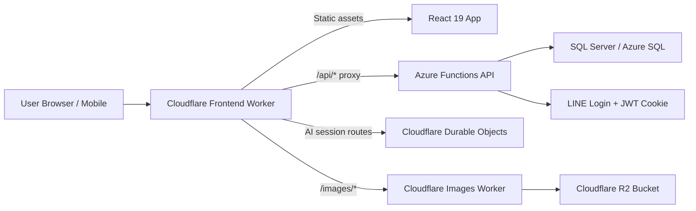

# Alife Technical Slices

A quick technical tour for potential future maintainers, ICT students, and lecturers.

This document is intentionally not too formal. The goal is not to explain every implementation detail in one go, but to help first-time readers understand a few key slices first: how the system is divided, why it is divided that way, what each layer is responsible for, and what skills are needed to take over development.

## 0. The one-sentence version

Alife is a full-stack application for a church context. The backend runs on Azure Functions, the frontend is a React 19 + TypeScript + Vite PWA, and the edge layer uses Cloudflare Workers for frontend hosting, API proxying, image services, and parts of the AI session flow.

If you are an ICT student, this can be understood as a strong example of a modern web system:

- it has layered backend architecture;
- it has frontend/backend separation;
- it has cloud APIs;
- it has an edge proxy layer;
- it has object-storage-backed image services;
- it has a mobile-friendly web application;
- and it already runs into the kinds of permission, caching, deployment, CORS, and maintainability issues that appear in real systems.

## 1. Start with the overall picture



The simplest way to understand it is:

- the App handles UI and user interaction;
- the Azure backend handles business rules, the database, and authorization;
- Cloudflare handles the edge entry point, proxying, images, and part of the real-time/session-oriented capabilities.

## 2. Slice A: What the Backend layer actually does

### What the Backend is

The backend is an Azure Functions application written in .NET 10, using a Clean Architecture style with separated layers.

The project structure is roughly:

```text
Alife.Domain         Pure domain models, entities, and enums
Alife.Application    Use cases, commands, queries, DTOs, business rules
Alife.Infrastructure EF Core, database access, external services, security, caching
Alife.Api            Azure Functions host layer, HTTP controllers
Alife.DbMigrator     Migration and seed tool
```

### Why it is split this way

This is not just to “look advanced.” It is done so that later changes are less likely to break everything at once.

- `Domain` tries to avoid depending on external frameworks.
- `Application` describes what the system should do.
- `Infrastructure` handles how SQL, OAuth, caching, and other concrete integrations work.
- `Api` receives HTTP requests and passes them inward.

For students, this is a very typical example of layered design plus dependency direction control.

### Tools used in this layer

- .NET SDK 10.0.100
- Azure Functions v4 isolated worker
- ASP.NET Core HTTP integration
- Entity Framework Core 10
- SQL Server
- Swashbuckle / Swagger
- HybridCache

### Technical highlights in the Backend

#### 1. Azure Functions here is more than “a few Functions”

Although this runs on Azure Functions, it is not just a loose set of single-function scripts. It already combines ASP.NET Core controller-style APIs, authentication, Swagger, DI, and the application layer.

That is valuable for teaching because it shows how a serverless host can be combined with a relatively complete Web API architecture.

#### 2. JWT is stored in an HttpOnly cookie, not frontend local storage

This is a good point to explain to students.

- Cookies are automatically sent by the browser.
- `HttpOnly` reduces the risk of frontend scripts reading the token directly.
- Authorization is not fully embedded into the token; the backend checks current data each time.

This opens discussion around XSS, permission synchronization, and minimal claims design.

#### 3. A CQRS-ish separation of reads and writes

The project is not an extreme CQRS platform, but commands and queries are clearly separated. That is useful in teaching because students can see:

- write flows and read flows often care about different things;
- DTOs, authorization checks, and cache invalidation play different roles on each path;
- real business systems usually do not rely on one giant “Service” for everything.

#### 4. Cache is added deliberately, not randomly

The project uses `.NET 10 HybridCache`, mainly on read-heavy paths such as member data, pages, groups, events, and sermons.

This is a realistic topic: once a system becomes a content platform with many reads and fewer writes, knowing where caching fits and where invalidation matters becomes more important than just knowing CRUD.

### Skills recommended for a Backend maintainer

To take over the backend, it helps to have at least:

- C# and .NET fundamentals
- HTTP API design
- EF Core and SQL basics
- basic authentication and authorization concepts
- dependency injection and layered architecture reading skills
- the ability to follow a controller -> application -> infrastructure call path

## 3. Slice B: Cloudflare is not only used to host static pages

This is one of the most interesting layers in the project for ICT students and lecturers, because it is close to modern edge architecture in practice.

### The Cloudflare layer is actually split into two parts

#### 1. Speed Layer Worker

The `wrangler.jsonc` in `cloudflare/speed-layer` shows that this Worker does more than serve static files. It also handles:

- SPA static asset hosting
- the `/api/*` proxy entry
- the `/images/*` edge entry
- AI session route dispatching
- Durable Object bindings
- Cloudflare Cache API response records and authorization metadata records

In other words, the browser sees one unified entry point, but behind it requests are split to different systems.

#### 2. Images API Worker

`cloudflare/images-api` is a separate image-service Worker. It binds directly to a Cloudflare R2 bucket and handles:

- listing images and subfolders
- uploading images
- deleting images or folders
- reading image objects by path

One thing should be made explicit here:

This repo does use R2, but not as a place where the main frontend Worker stores all business data. Instead, a separate image API Worker uses R2 specifically as object storage for images.

### How to understand DNS / Proxy / Worker together

The plainest explanation is:

- Cloudflare DNS sends domain traffic to Cloudflare;
- a Cloudflare Worker receives the request;
- the Worker then decides whether to return static pages, forward to the API, enter an AI session flow, or route to the image service.

For students, this is a good example of reverse proxying, edge logic, and unified entry across multiple services.

### Technical highlights in the Cloudflare layer

#### 1. The Worker is both hosting layer and routing layer

In this project, the Worker is not an optional deployment accessory. It is part of the architecture. It unifies the browser entry point and reduces the complexity of exposing multiple origins directly to the frontend.

#### 2. Durable Objects are used for AI session flows

The speed layer Worker binds multiple Durable Object classes to support session flows such as event planning, registration, and review.

That means the project is no longer just a CRUD website; it is already moving into stateful interaction design.

This is useful in class discussions:

- what scenarios fit Durable Objects;
- why session state is not always best stored in the frontend;
- how edge state and backend persistent data should be separated.

#### 3. Cache API records support edge cache and authorization mirrors

The Worker uses the Cloudflare Cache API for stored responses and lightweight logical records. This supports ETags, shared group cache decisions, and authorization mirrors without calling the origin for every request.

#### 4. R2 helps separate image handling from the main business API

Using R2 plus a dedicated Worker for images brings several direct benefits:

- image upload and browsing do not need to be pushed into the main business API;
- images can have their own domain and path conventions;
- it is easier in the future to add caching, permissions, or transformation logic.

### Skills recommended for a Cloudflare maintainer

To take over this layer, it helps to know:

- Cloudflare Worker basics
- Wrangler configuration and deployment concepts
- routing and reverse proxy fundamentals
- the differences between the Cloudflare Cache API, Durable Objects, and R2
- browser/network basics such as CORS, cookies, origin, and domain

## 4. Slice C: The Frontend App layer is more than React pages

### What the Frontend is

The frontend is a React 19 + TypeScript + Vite PWA. It uses Tailwind CSS for styling, TanStack Query / React DB for data flow, and Axios for HTTP.

TanStack deserves special mention here because it is not just a small helper added for API fetching. It is an important part of the frontend data layer. It handles two practical jobs at the same time:

- first, it provides frontend data caching and persists some read results into browser storage, helping pages restore content faster on weak networks or repeat visits;
- second, it acts as the data source layer for smart list sections such as `ListView` and `GroupList`, so page sections do not each need their own custom fetch logic.

It is better understood as a real web application built for actual usage, not as a static website.

### Why React 19 + Vite

To be clear: this is `Vite`, not `Lite`.

React 19 handles the component and interaction model, while Vite handles local development and frontend bundling. This combination is now common, with a few clear benefits:

- fast local startup;
- natural TypeScript integration;
- clear frontend/backend separation;
- a good sample stack for students learning modern frontend engineering.

### What the Frontend is responsible for in this project

- routing and page entry points
- user state initialization after login
- group pages and admin pages
- page editor and section editor
- UI flows for events, registration, and review
- mobile-friendly browsing
- PWA installation and cache-related experience

### Technical highlights in the Frontend

#### 1. It is not just UI, but a complete App Shell

The project does not use React just to assemble a few pages. It has its own App Shell, providers, route tree, group context, and data services.

This matters for students because many exercises stop at “single-page components,” while real systems have to deal with:

- global auth state;
- route transitions;
- data refresh;
- error handling;
- different entry points for different roles.

#### 1.5. TanStack is the frontend data foundation, not just “data fetching”

In this frontend, TanStack can be understood as a local-first data middle layer. It is not just responsible for moving remote API results into React state. It brings together several tasks that are usually awkward in real projects:

- query result caching;
- data reuse when re-entering screens;
- local collection querying;
- offline or weak-network reads with IndexedDB;
- allowing multiple pages or sections to share the same data source.

More concretely, this is `TanStack Query + TanStack DB + idb-keyval` working together:

- `TanStack Query` handles query coordination and invalidation;
- `TanStack React DB` organizes data into subscribable collections;
- `idb-keyval` stores HTTP results with ETags into browser IndexedDB.

So its value is not “writing fewer fetch calls.” Its value is unifying caching, reuse, local reads, and list data into one consistent pattern.

#### 2. Page content uses a CMS-ish section model

Pages in this project are not one large HTML string. They are structured, section-based content. In other words, a page is composed of multiple content blocks.

That is worth teaching because it touches on:

- content modeling;
- page editor design;
- separation of rendering components and content structure;
- bilingual titles, summaries, and page visibility.

A good example is `ListView`. On screen it looks like a normal content block, but underneath it is not hard-coded. Its metadata specifies whether the list should display sermons, subgroups, members, pages, or events, and then a unified data resolution layer fetches the right data.

In other words, `ListView` / `GroupList` is not only a visual component. It is where the page content model and the TanStack data layer meet.

#### 3. The relationship between frontend and auth is handled realistically

Axios is configured with `withCredentials: true`, meaning the frontend does not store tokens itself and manually attach headers. Instead, it works with the browser cookie model and backend authorization mechanisms.

This helps students understand that authentication in real systems often depends on the browser, cookies, CORS, and backend middleware together, not only on a frontend `localStorage.getItem()` call.

#### 4. PWA means it is close to an installable mobile web app

This is practical in a church context, because users may not want to download a native app, but may still be willing to add a website to their phone’s home screen.

Also, the PWA experience here is not only about the service worker. The TanStack layer keeps previously viewed data in local collections and browser storage, so things like page lists, group lists, and sermon lists are more stable on re-entry, weak networks, or offline-edge situations than a model that always starts with a fresh API call.

#### 5. TanStack is also the source layer for `ListView` / `GroupList`

If this project is used as a teaching case, this part is especially worth explaining.

A block such as `GroupListSection` does not directly decide where its data comes from. It passes metadata to `useListSourceResolver`. That resolver then maps the source type to the correct TanStack collection, for example:

- sermons collection
- subgroups collection
- group memberships collection
- group pages collection
- group events collection

After that it consistently handles:

- local-first reads;
- conditional API fetching;
- filtering and sorting;
- limit truncation;
- and only then passes the result to the UI as a card list.

That turns `ListView` into a genuinely reusable content block. Editors change metadata, while developers maintain one unified data-source layer instead of rewriting a component and API call for every list type.

### Skills recommended for a Frontend maintainer

To take over the frontend, it helps to know:

- TypeScript basics
- React components, state, effect, and context
- React Router basics
- TanStack Query / React DB basics
- HTTP / REST / Axios basics
- HTML/CSS/Tailwind basics
- browser cache, IndexedDB, and offline-read concepts
- what build, preview, and deploy scripts do

## 5. Slice D: How data, permissions, and content intersect

To really understand the system, do not look only at “frontend,” “backend,” and “cloud.” Also look at the cross-cutting path of how business data moves through the system.

### A typical flow: user opens the App

1. The browser enters through the Cloudflare frontend entry point.
2. The Worker returns static assets and the frontend App.
3. After startup, the App calls `/api/me`.
4. The request goes through the Worker proxy to Azure Functions.
5. The backend reads the JWT from the HttpOnly cookie, then resolves the current member.
6. The backend determines visible data based on database relationships and permissions.
7. The frontend uses that to decide navigation, pages, and editable scope.

### A typical flow: user browses images

1. The frontend requests `/images/*` or an image-related URL.
2. The Cloudflare image Worker receives the request.
3. The Worker reads the object or lists the directory from the R2 bucket.
4. The result is returned to the frontend.

### A typical flow: AI-assisted event session

1. The frontend sends user input to `/api/events/session/*` or a related session path.
2. The Cloudflare Worker dispatches the request to the corresponding Durable Object.
3. The Durable Object maintains the session state.
4. When complete, the draft or result is submitted to the backend REST API for persistence.

These flows work well in teaching because they connect five system roles together: browser, edge, API, database, and stateful session handling.

## 6. What is needed for local development

To let students or future maintainers at least get the system running, it is recommended to prepare:

- .NET SDK 10.0.x
- Node.js 20+
- Docker Desktop
- Wrangler CLI
- a SQL Server container environment
- basic Git skills

### Minimal local steps

#### Backend

```powershell
cd backend
docker compose up -d sqlserver
dotnet run --project src/Alife.DbMigrator
dotnet run --project src/Alife.Api
```

#### Frontend

```powershell
cd cloudflare/alife-app
npm install
npm run dev
```

#### Build-only verification

```powershell
dotnet build backend/Alife.sln -c Debug
cd cloudflare/alife-app
npm run build
```

### A realistic note about the current state

Based on the current repo record:

- the backend unit test project passes in the current verification run;
- the frontend build passes, with the current Vite large-chunk warning;
- the speed-layer Worker test suite also passes in the current verification run.

That is actually useful for teaching, because it is closer to a real project than a perfect classroom example.

## 7. A skills map for ICT students

This project can be divided into different levels of participation.

### Level 1: Can understand it and run it

Suitable for students who are just starting with modern web applications.

Recommended skills:

- basic Git
- ability to run `dotnet build` and `npm run build`
- ability to read README files and environment variables
- knowing where the frontend, backend, and database are

### Level 2: Can change one feature slice

Suitable for students who already studied web development basics.

Recommended skills:

- at least one side of C# or TypeScript
- ability to modify an API or frontend form
- ability to read basic SQL / EF Core
- ability to trace one feature path: UI -> API -> DB

### Level 3: Can take over a module

Suitable for capstone projects, teaching assistants, or future maintainers.

Recommended skills:

- ability to understand layered architecture
- ability to debug authentication / authorization problems
- ability to work with Cloudflare Worker / Azure Functions configuration
- ability to handle cross-layer issues such as caching, edge proxying, session state, and image services

## 8. Teaching entry points for lecturers

If Alife is used as a teaching case, these are good angles:

1. How Clean Architecture is applied in a real system, not only in UML.
2. How Azure Functions can host a relatively complete API system.
3. How a React app works with cookie-based authentication.
4. How a Cloudflare Worker can do static hosting, proxying, and edge logic at the same time.
5. What kinds of problems R2, Durable Objects, and the Cloudflare Cache API are each good at solving.
6. Why real projects inevitably run into build, test, deployment, cache, and CORS issues.

## 9. Suggested first-week tasks for a new developer

If someone is taking over the project, it is better not to start with a large feature. These smaller tasks are a better first step:

1. Get both backend and frontend to build successfully.
2. Run the local API and frontend page.
3. Understand how the `/api/me` path flows through the system after login.
4. Understand how one page goes from DB to API to React rendering.
5. Understand how images are served through Cloudflare Worker and R2.
6. Understand why an AI session route goes to a Durable Object first instead of directly into the Azure API.

After these six steps, the system becomes much more concrete.

## 10. One final sentence

Alife is not a project that can be taken over by “someone who only knows frontend,” nor can it be fully understood by “someone who only writes backend APIs.” Its real learning value is that it brings several key aspects of a modern web system together:

- a .NET 10 backend on Azure
- Cloudflare DNS / Worker / Proxy / R2 / Durable Objects
- a React 19 + TypeScript + Vite app frontend
- SQL, authentication, caching, content modeling, and deployment engineering concerns

So, if it is being introduced to ICT students and lecturers, the most suitable description is not “this is a church website,” but:

This is a medium-sized, technically well-rounded, real-world application sample that is well suited for learning modern full-stack and edge architecture.
