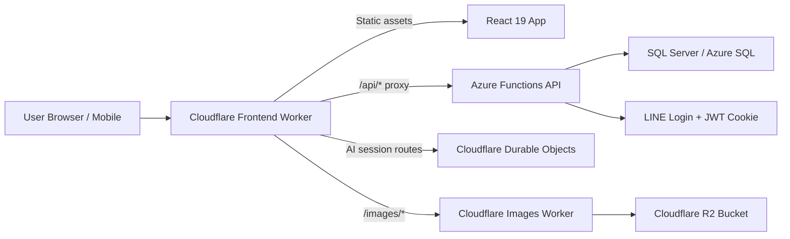

# Alife Technical Slices

A practical technical guide for future maintainers, ICT students, and lecturers.

This document is meant to be approachable rather than overly formal. The aim is not to explain every implementation detail at once, but to help new readers get a solid feel for the main slices of the system: how it is split up, why it is split that way, what each layer is responsible for, and what kind of skills are useful for taking it over.

## 0. The short version

Alife is a full-stack application built for a church setting. The backend runs on Azure Functions, the frontend is a React 19 + TypeScript + Vite PWA, and the edge layer uses Cloudflare Workers for frontend hosting, API proxying, image delivery, and part of the AI session workflow.

For ICT students, it works well as a sample of a modern web system because it includes:

- a layered backend architecture;
- a clear frontend/backend split;
- cloud-hosted APIs;
- an edge proxy layer;
- object-storage-based image handling;
- a mobile-friendly web app;
- and the kinds of real-world issues that actual systems run into: permissions, caching, deployment, CORS, and maintainability.

## 1. The big picture first



The simplest way to think about it is:

- the App handles the UI and user interaction;
- the Azure backend handles business rules, data, and authorization;
- Cloudflare handles the edge entry point, proxying, images, and some session-style behaviour.

## 2. Slice A: What the Backend is really doing

### What the Backend is

The backend is an Azure Functions application written in .NET 10, organised in a Clean Architecture-style layered structure.

The project layout looks roughly like this:

```text
Alife.Domain         Domain models, entities, enums
Alife.Application    Use cases, commands, queries, DTOs, business rules
Alife.Infrastructure EF Core, database access, external services, security, caching
Alife.Api            Azure Functions host layer, HTTP controllers
Alife.DbMigrator     Migration and seed tool
```

### Why it is split this way

This is not just for neatness or style. The point is to make the system easier to maintain and less likely to break everywhere when one part changes.

- `Domain` stays as framework-independent as possible.
- `Application` defines what the system does.
- `Infrastructure` handles how things connect to SQL, OAuth, caching, and other external systems.
- `Api` accepts HTTP requests and passes them into the application layer.

For students, this is a good example of layered design with clear dependency direction.

### What the Backend uses

- .NET SDK 10.0.100
- Azure Functions v4 isolated worker
- ASP.NET Core HTTP integration
- Entity Framework Core 10
- SQL Server
- Swashbuckle / Swagger
- HybridCache

### Interesting backend details

#### 1. Azure Functions here is more than just “a bunch of functions”

Even though the backend runs on Azure Functions, it is not just a loose set of single-purpose function files. It already combines ASP.NET Core controller-style APIs, authentication, dependency injection, Swagger, and an application layer.

That makes it a useful teaching example of how serverless hosting can still support a fairly complete API architecture.

#### 2. JWT lives in an HttpOnly cookie, not in local storage

This is a very practical design choice.

- Cookies are sent automatically by the browser.
- `HttpOnly` reduces the risk of frontend scripts reading the token directly.
- Permissions are not just frozen inside the token; the backend checks current data when handling requests.

This is a good opening for talking about XSS, token design, and why authorization should reflect current state.

#### 3. Reads and writes are separated in a CQRS-like way

The project is not a heavy CQRS system, but it does clearly separate commands and queries. That helps show that:

- read paths and write paths often have different priorities;
- DTOs, authorization, and cache invalidation matter differently in each path;
- real systems often need something more structured than one huge service class.

#### 4. Caching is used on purpose

The system uses `.NET 10 HybridCache`, especially on read-heavy paths like member data, pages, groups, events, and sermons.

That matters because once a system becomes more content-heavy, knowing where to cache and how to invalidate cache becomes as important as knowing how to write CRUD endpoints.

### What someone taking over the Backend should know

Useful background includes:

- C# and .NET basics
- HTTP API design
- EF Core and SQL basics
- authentication and authorization concepts
- dependency injection and layered architecture
- how to trace a request from controller -> application -> infrastructure

## 3. Slice B: Cloudflare is doing more than hosting static files

This is one of the most interesting parts of the system from a teaching point of view, because it reflects how modern edge-based systems are often put together.

### The Cloudflare side has two main parts

#### 1. Speed Layer Worker

The `wrangler.jsonc` in `cloudflare/speed-layer` shows that this Worker does much more than serve built frontend assets. It also handles:

- SPA static asset hosting
- the `/api/*` proxy entry point
- the `/images/*` edge route
- AI session route dispatch
- Durable Object bindings
- Cloudflare Cache API response records and authorization metadata records

So from the browser’s point of view, there is one main entry point, even though requests are routed to different services behind the scenes.

#### 2. Images API Worker

`cloudflare/images-api` is a separate Worker for image handling. It connects directly to a Cloudflare R2 bucket and is responsible for:

- listing images and folders
- uploading images
- deleting images or folders
- reading image objects by path

One clarification is worth making:

This repo does use R2, but not as the main storage for all business data. Instead, a separate image Worker uses R2 specifically as object storage for image files.

### How DNS, proxying, and Workers fit together

The plain-English version is:

- Cloudflare DNS points domain traffic into Cloudflare;
- a Worker receives the request;
- the Worker decides whether to return static frontend files, proxy to the backend API, route into an AI session flow, or hand the request to the image service.

For students, this is a strong example of reverse proxying, edge logic, and a unified frontend entry for multiple services.

### Interesting Cloudflare details

#### 1. The Worker is both the hosting layer and the routing layer

In this project, the Worker is not just a deployment extra. It is part of the architecture. It gives the browser one consistent entry point and reduces the need for the frontend to talk directly to several different origins.

#### 2. Durable Objects are used for AI session flows

The speed layer Worker binds several Durable Object classes for flows such as event planning, registration, and review.

That means the system has already moved beyond simple CRUD patterns into stateful workflow design.

This is useful for teaching questions like:

- when Durable Objects make sense;
- why session state is not always best kept in the frontend;
- how to split responsibility between edge session state and backend persistence.

#### 3. Cache API records support lightweight edge-side state

The Worker uses the Cloudflare Cache API for stored responses and lightweight logical records. This is useful for ETags, cache-like data, and authorization-related metadata without calling the origin for every request.

#### 4. R2 helps keep image handling separate from the main API

Using R2 with a dedicated image Worker makes a lot of sense because:

- image upload and browsing do not have to be mixed into the main business API;
- images can have their own path rules and domain setup;
- caching, transformations, or permission rules can be developed separately later.

### What someone taking over the Cloudflare layer should know

Useful background includes:

- Cloudflare Workers
- Wrangler config and deployment
- routing and reverse proxy basics
- the difference between the Cloudflare Cache API, Durable Objects, and R2
- browser/network basics such as CORS, cookies, origin, and domain

## 4. Slice C: The Frontend is more than a set of React pages

### What the Frontend is

The frontend is a React 19 + TypeScript + Vite PWA. It uses Tailwind CSS for styling, Axios for HTTP, and TanStack Query / React DB for the data layer.

TanStack is especially important here. It is not just a convenience library for fetching API data. It plays a real architectural role in two ways:

- it provides client-side caching and stores some read results in browser storage, which helps the app recover faster on repeat visits or unreliable networks;
- it acts as the shared data-source layer for list-style sections such as `ListView` and `GroupList`, so those sections do not all have to implement their own fetch logic.

That makes the frontend feel much more like a real application than a static website.

### Why React 19 + Vite

Just to be explicit: this is `Vite`, not `Lite`.

React 19 provides the component model and interaction layer. Vite provides fast local development and bundling. Together they are a very common modern setup, with clear benefits:

- quick startup during development
- natural TypeScript support
- clean separation from the backend
- a good learning platform for modern frontend engineering

### What the Frontend is responsible for

- routing and page entry points
- loading user state after login
- group pages and admin pages
- page editing and section editing
- event, registration, and review UI flows
- mobile-friendly browsing
- PWA installation and cache-related behaviour

### Interesting frontend details

#### 1. It works as a full App Shell

React is not just being used to render a few isolated pages. The frontend has an App Shell, providers, a route tree, group context, and data services.

That is important because real applications have to deal with things like:

- global auth state
- route changes
- data refresh
- error handling
- different navigation paths for different roles

#### 1.5. TanStack is the app’s data backbone

In this project, TanStack is best understood as a local-first data layer. It does much more than move remote API results into React state.

It helps bring together:

- query caching
- data reuse when a user comes back to a page
- local collection querying
- offline or weak-network access through IndexedDB
- shared data sources across multiple screens and sections

More specifically, the project combines `TanStack Query + TanStack DB + idb-keyval`:

- `TanStack Query` coordinates queries and invalidation;
- `TanStack React DB` structures the data as subscribable collections;
- `idb-keyval` stores ETagged HTTP results in browser IndexedDB.

So the real value is not “less fetch code.” The real value is a consistent way to handle caching, reuse, local access, and list-driven UI.

#### 2. Pages use a CMS-like section model

Pages are not treated as one big HTML blob. Instead, they are built from structured sections.

That is useful to study because it touches on:

- content modelling
- page editor design
- separation between content structure and rendering
- bilingual titles, summaries, and visibility settings

`ListView` is a good example. On the surface it looks like a normal content section, but the data is not hard-coded. Metadata tells it whether to show sermons, subgroups, members, pages, or events, and then a shared resolver layer loads the correct data.

So `ListView` / `GroupList` is not just a visual component. It is where the page-content model and the frontend data layer come together.

#### 3. Auth is handled in a way that matches real browser behaviour

Axios is set up with `withCredentials: true`, so the frontend is not manually storing tokens and attaching headers itself. Instead, it works with the browser’s cookie model and the backend’s authorization logic.

That helps students see that real authentication flows usually involve the browser, cookies, CORS, and backend middleware together.

#### 4. The PWA model makes it close to an installable mobile app

This is useful in a church setting, where users may not want to install a native app but may still be happy to add a website to their home screen.

It is also worth noting that the PWA experience here is not only about the service worker. The TanStack-based local data layer helps previously viewed content stay available and recover more smoothly.

#### 5. TanStack also powers `ListView` / `GroupList`

This is a particularly good teaching example.

A section like `GroupListSection` does not fetch its own data directly. Instead, it passes metadata to `useListSourceResolver`, which maps the source type to the right TanStack collection, such as:

- sermons collection
- subgroups collection
- group memberships collection
- group pages collection
- group events collection

From there, the same general process is applied:

- local-first reading
- conditional API fetches
- filtering and sorting
- limiting the result set
- handing the final result to the UI

This makes `ListView` genuinely reusable. Editors change metadata, while developers maintain one common data-source layer instead of rewriting fetch logic for every list type.

### What someone taking over the Frontend should know

Useful background includes:

- TypeScript basics
- React components, state, effects, and context
- React Router
- TanStack Query / React DB basics
- HTTP / REST / Axios basics
- HTML, CSS, and Tailwind CSS
- browser cache, IndexedDB, and offline-read concepts
- what build, preview, and deploy scripts do

## 5. Slice D: How data, permissions, and content cross layers

To really understand the system, it is not enough to look at frontend, backend, and cloud as separate boxes. It also helps to trace how data moves through the system.

### A typical flow: a user opens the app

1. The browser enters through the Cloudflare frontend entry point.
2. The Worker returns static assets and the frontend app.
3. After startup, the app calls `/api/me`.
4. The request is proxied by the Worker to Azure Functions.
5. The backend reads the JWT from the HttpOnly cookie and resolves the current member.
6. The backend decides what data is visible based on relationships and permissions in the database.
7. The frontend uses that result to determine navigation, page access, and editing scope.

### A typical flow: a user browses images

1. The frontend requests `/images/*` or another image URL.
2. The Cloudflare image Worker receives the request.
3. The Worker reads the object or lists the relevant path from R2.
4. The response is returned to the frontend.

### A typical flow: an AI-assisted event session

1. The frontend sends user input to `/api/events/session/*` or a related route.
2. The Cloudflare Worker sends the request to the matching Durable Object.
3. The Durable Object manages the session state.
4. When the flow finishes, the result or draft is submitted to the backend REST API for persistence.

These examples are useful because they connect browser, edge, API, database, and stateful session logic in one clear sequence.

## 6. What is needed for local development

To let students or future maintainers run the system locally, it is helpful to have:

- .NET SDK 10.0.x
- Node.js 20+
- Docker Desktop
- Wrangler CLI
- a SQL Server container setup
- basic Git skills

### Minimal local steps

#### Backend

```powershell
cd backend
docker compose up -d sqlserver
dotnet run --project src/Alife.DbMigrator
dotnet run --project src/Alife.Api
```

#### Frontend

```powershell
cd cloudflare/alife-app
npm install
npm run dev
```

#### Build-only check

```powershell
dotnet build backend/Alife.sln -c Debug
cd cloudflare/alife-app
npm run build
```

### A realistic note about the current state

Based on the current repo state:

- the backend unit test project passes in the current verification run;
- the frontend build passes, with the current Vite large-chunk warning;
- the speed-layer Worker test suite also passes in the current verification run.

That is actually useful to point out, because it reflects the state many real projects end up in: the main system runs, but test maintenance still needs work.

## 7. A skills map for ICT students

This project supports different levels of involvement.

### Level 1: Can understand it and run it

Good for students who are just getting started with modern web applications.

Recommended skills:

- basic Git
- ability to run `dotnet build` and `npm run build`
- ability to read README files and environment variables
- knowing where the frontend, backend, and database parts are

### Level 2: Can change one feature slice

Good for students who already have some web development background.

Recommended skills:

- confidence in either C# or TypeScript
- ability to change an API endpoint or a frontend form
- ability to read basic SQL / EF Core logic
- ability to trace a feature path from UI -> API -> DB

### Level 3: Can take over a module

Good for capstone work, teaching assistants, or future maintainers.

Recommended skills:

- understanding layered architecture
- debugging authentication and authorization issues
- working with Cloudflare Worker and Azure Functions configuration
- handling cross-layer concerns such as caching, edge proxying, session state, and image services

## 8. Good teaching angles for lecturers

If Alife is used as a teaching case, useful entry points include:

1. How Clean Architecture looks in a real working system, not just in diagrams.
2. How Azure Functions can host a fairly complete API.
3. How a React app works with cookie-based authentication.
4. How a Cloudflare Worker can combine static hosting, proxying, and edge logic.
5. What R2, Durable Objects, and the Cloudflare Cache API are each good for.
6. Why real projects inevitably run into build, test, deployment, caching, and CORS issues.

## 9. Good first-week tasks for a new maintainer

A new maintainer should probably not begin with a big feature. A better first week would be:

1. Get both backend and frontend building successfully.
2. Run the local API and the frontend app.
3. Understand how `/api/me` flows through the system after login.
4. Trace how one page goes from the database to the API to React rendering.
5. Understand how images are served through Cloudflare Workers and R2.
6. Understand why AI session routes go through Durable Objects before reaching the Azure API.

Once those six steps are done, the system becomes much easier to reason about.

## 10. Final note

Alife is not a project that can be fully taken over by someone who only knows frontend work, and it is not a system that can be fully understood by someone who only writes backend APIs. Its real value as a learning case is that it brings together several important parts of a modern web system:

- a .NET 10 backend on Azure
- Cloudflare DNS / Worker / Proxy / R2 / Durable Objects
- a React 19 + TypeScript + Vite app frontend
- SQL, authentication, caching, content modelling, and deployment concerns

So if it is being introduced to ICT students and lecturers, the most accurate description is probably not “this is a church website,” but:

This is a medium-sized, technically well-rounded, real-world application that works well as a learning sample for modern full-stack and edge architecture.
