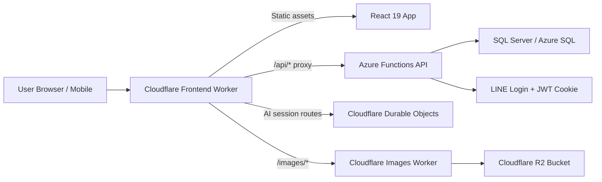

# Alife 技术说明 Slices

给潜在后继开发者、ICT 专业学生与讲师的快速技术导览。

这份说明书故意不写得太正式。目标不是把所有实现细节一次讲完，而是让第一次接触这个项目的人，能先抓住几个关键切片：系统怎么分、为什么这样分、每层各自处理什么、接手开发大概要具备哪些能力。

## 0. 一句话先讲清楚

Alife 是一个教会场景的全栈应用，后端跑在 Azure Functions 上，前端是 React 19 + TypeScript + Vite 的 PWA，边缘层用 Cloudflare Worker 处理前端托管、API 代理、图片服务和部分 AI 会话流程。

如果你是 ICT 学生，可以把它理解成一个很好的“现代 Web 系统样本”：

- 有后端分层架构；
- 有前后端分离；
- 有云端 API；
- 有边缘代理；
- 有对象存储图片服务；
- 有手机友善网页应用；
- 也已经碰到真实系统才会出现的权限、缓存、部署、跨域和可维护性问题。

## 1. 先看全貌



最简单的理解方式是：

- App 负责界面与用户交互；
- Azure 后端负责业务规则、资料库和权限；
- Cloudflare 负责边缘入口、代理、图片与部分实时/会话型能力。

## 2. Slice A: Backend 这层到底在做什么

### Backend 是什么

Backend 是一个用 .NET 10 写的 Azure Functions 应用，采用 Clean Architecture 的分层方式。

实际项目结构大致是：

```text
Alife.Domain         纯领域模型，放实体和枚举
Alife.Application    用例、命令、查询、DTO、业务规则
Alife.Infrastructure EF Core、资料库、外部服务、安全与缓存
Alife.Api            Azure Functions 主机层、HTTP 控制器
Alife.DbMigrator     迁移与 seed 工具
```

### 为什么这样切

这不是为了“看起来高级”，而是为了让后续维护时比较不容易一改全坏。

- `Domain` 尽量不依赖外部框架。
- `Application` 负责描述“系统要做什么”。
- `Infrastructure` 负责“具体怎么接 SQL、怎么做 OAuth、怎么做缓存”。
- `Api` 负责把 HTTP 请求接进来。

对学生来说，这是很典型的“分层 + 依赖方向控制”案例。

### 这一层用了什么工具

- .NET SDK 10.0.100
- Azure Functions v4 isolated worker
- ASP.NET Core HTTP integration
- Entity Framework Core 10
- SQL Server
- Swashbuckle / Swagger
- HybridCache

### Backend 的技术热点

#### 1. Azure Functions 不只是写几个 Function

这里虽然跑在 Azure Functions 上，但并不是简单的“单个函数脚本集合”，而是已经把 ASP.NET Core controller 风格的 API、认证、Swagger、DI 和应用层组合起来了。

这点对教学很有价值，因为它展示了“Serverless 宿主 + 较完整 Web API 架构”可以怎么结合。

#### 2. JWT 放在 HttpOnly Cookie，而不是前端 Local Storage

这是个很值得讲给学生听的点。

- Cookie 由浏览器自动带上。
- `HttpOnly` 降低前端脚本直接读 token 的风险。
- 权限不是直接塞满在 token 里，而是每次由后端按当前资料判断。

这能引出 XSS、权限同步、最小 claims 设计这些安全话题。

#### 3. CQRS-ish 的读写分离思路

项目里虽然不是极度复杂的 CQRS 平台，但已经明显把 command 和 query 分开。这对教学来说很实用，因为学生可以看到：

- 写入流程和读取流程常常关心的东西不一样；
- DTO、授权检查、缓存失效在读写路径中有不同角色；
- 真正的业务系统通常不会只靠一个“大 Service”包办全部。

#### 4. Cache 不是乱加的

项目用的是 `.NET 10 HybridCache`，重点放在成员资料、页面、群组、活动、讲道等读取路径上。

这是个典型现实题：当系统变成“读多写少”的内容平台后，哪些地方适合缓存，哪些地方要做失效，比“会不会写 CRUD”更重要。

### Backend 接手者要会什么

如果要接 backend，建议至少具备：

- C# 与 .NET 基础
- HTTP API 设计
- EF Core 和 SQL 基础
- 身份验证与授权基本概念
- 依赖注入和分层结构阅读能力
- 看得懂 controller -> application -> infrastructure 的调用路径

## 3. Slice B: Cloudflare 不是只拿来挂静态网页

这是这个项目里最值得介绍给 ICT 学生和讲师的一层，因为它很贴近现代云端边缘架构。

### Cloudflare 这一层实际上分成两块

#### 1. Frontend Worker

前端目录里的 `wrangler.jsonc` 表明，这个 Worker 不只是发静态档案，它还同时处理：

- SPA 静态资源托管
- `/api/*` 的代理入口
- `/images/*` 的边缘入口
- AI session 路由分发
- Durable Objects 绑定
- KV namespace 绑定

也就是说，浏览器眼中看到的是一个统一入口，但后面其实分流到了不同系统。

#### 2. Images API Worker

`cloudflare/images-api` 是独立的图片服务 Worker。它直接绑定 Cloudflare R2 bucket，负责：

- 列出图片和子资料夹
- 上传图片
- 删除图片或资料夹
- 通过路径读取图片对象

这里要特别说明一件事：

这个 repo 里确实有使用 R2，但不是主前端 Worker 直接把所有业务资料放进 R2，而是由独立的图片 API Worker 把 R2 当作图片对象存储来使用。

### DNS / Proxy / Worker 关系怎么理解

可以用最直白的话来讲：

- Cloudflare DNS 把域名流量导向 Cloudflare；
- Cloudflare Worker 接住请求；
- Worker 再决定是回静态网页、转发 API、进 AI session、还是走图片服务。

这对学生来说是一个很好的“反向代理 + 边缘逻辑 + 多服务入口聚合”的实例。

### Cloudflare 的技术热点

#### 1. Worker 既是托管层，也是路由层

在这个项目里，Worker 不是可有可无的部署附件，而是架构的一部分。它把浏览器入口统一起来，也减少前端直接面对多个不同 origin 的复杂度。

#### 2. Durable Objects 用在 AI 会话流程

前端 Worker 绑定了多个 Durable Object class，用来承载活动规划、报名和回顾这类会话流程。

这代表项目已经不是纯 CRUD 网站，而是开始进入“有状态交互流程”的系统设计。

这点很适合课堂上讲：

- 什么场景适合 Durable Objects；
- 为什么会话状态不一定放在前端；
- 边缘状态与后端持久数据该怎么分工。

#### 3. KV 适合轻量边缘缓存或授权镜像

Worker 里还有 KV namespace 绑定，表示这个系统并不把所有边缘逻辑都做成实时回源，也会利用 Cloudflare 提供的轻量存储做辅助能力。

#### 4. R2 让图片服务从主业务 API 拆开

把图片对象交给 R2 + 独立 Worker，有几个直接好处：

- 图片上传和浏览不必塞进主业务 API；
- 图片可以有独立域名与路径规范；
- 未来更容易加缓存、权限或转换逻辑。

### Cloudflare 接手者要会什么

如果要接 Cloudflare 这层，建议至少具备：

- Cloudflare Worker 基础
- Wrangler 配置与部署概念
- 路由与反向代理基本概念
- KV、Durable Objects、R2 的用途差异
- CORS、cookie、origin、domain 这些浏览器网络基础

## 4. Slice C: Frontend App 这层不只是 React 页面

### Frontend 是什么

Frontend 是 React 19 + TypeScript + Vite 的 PWA。样式上用 Tailwind CSS，数据流上用了 TanStack Query / React DB，HTTP 用 Axios。

这里要特别点名一下 TanStack，因为它在这个项目里不是“顺手装来抓 API”的小工具，而是前端数据层的重要骨架。它同时承担两件很实际的工作：

- 第一，提供前端数据缓存，并且把部分读取结果落到浏览器本地存储，帮助页面在弱网或重复进入时更快恢复内容；
- 第二，作为 `ListView` / `GroupList` 这种智能列表区块的数据来源层，让页面区块不用自己各写一套抓资料逻辑。

你可以把它理解成一个“面向实际使用的 Web App”，而不是静态官网。

### 为什么用 React 19 + Vite

先讲清楚：这里是 `Vite`，不是 `Lite`。

React 19 负责组件与互动模型，Vite 负责本地开发和前端打包。这样的组合现在很常见，优点是：

- 本地开发启动快；
- TypeScript 整合自然；
- 前后端分离清楚；
- 很适合作为学生熟悉现代前端工程的练习样本。

### Frontend 在项目里负责什么

- 路由与页面入口
- 登录后用户状态初始化
- 群组页面和管理页面
- 页面编辑器与区块编辑
- 活动、报名与回顾等 UI 流程
- 手机端友善浏览体验
- PWA 安装与缓存相关体验

### Frontend 的技术热点

#### 1. 不只是 UI，而是完整 App Shell

项目不是把 React 拿来拼几个页面，而是有自己的 App Shell、provider、route tree、group context、data services。

这对学生很重要，因为很多课程练习只做到“单页组件”，但实际系统要面对的是：

- 全局身份状态；
- 路由切换；
- 数据刷新；
- 错误处理；
- 不同角色看到不同入口。

#### 1.5. TanStack 是前端的数据底座，不只是“抓资料”

这套前端里，TanStack 的角色可以简单理解成“本地优先的数据中间层”。它不是只负责把远端 API 结果塞进 React state，而是把几件平常在真实项目里很麻烦的事整合起来：

- 查询结果缓存；
- 画面重新进入时的数据复用；
- 本地集合查询；
- 与 IndexedDB 结合的离线/弱网读取；
- 让多个页面或区块共用同一份数据来源。

如果要讲得更工程一点，这里是 `TanStack Query + TanStack DB + idb-keyval` 一起工作：

- `TanStack Query` 负责查询协作和失效管理；
- `TanStack React DB` 把资料组织成可订阅的 collection；
- `idb-keyval` 负责把带有 ETag 的 HTTP 结果写进浏览器 IndexedDB。

所以它的价值不是“少写几行 fetch”，而是把缓存、重用、本地读取和列表数据整合成统一模式。

#### 2. 页面内容是 CMS-ish 的 section 模型

这个项目的页面并不是一整块 HTML 字串，而是 section-based 的结构化内容。换句话说，页面是由一段一段区块组成的。

这很值得讲，因为它触及：

- 内容建模；
- 页面编辑器设计；
- 渲染组件与内容结构分离；
- 双语标题、摘要和页面可见性。

其中一个很好的例子就是 `ListView`。它在画面上看起来像一个普通内容区块，但底下其实不是写死资料，而是由 metadata 指定“这个列表要显示 sermons、subgroups、members、pages 还是 events”，再交给统一的数据解析层去取资料。

换句话说，`ListView` / `GroupList` 不是单纯的视觉组件，而是“页面内容模型 + TanStack 数据层”的结合点。

#### 3. 前端和认证的关系处理得比较现实

Axios 设定 `withCredentials: true`，表示前端不是自己存 token 再手动拼 header，而是配合浏览器 cookie 模型和后端授权机制工作。

这能帮助学生理解：真实系统里的认证流程，很多时候是浏览器、cookie、CORS、后端中介层一起配合，而不是单靠前端一段 `localStorage.getItem()`。

#### 4. PWA 代表它接近手机上的“可安装网页应用”

这对教会场景很实用，因为用户不一定会下载原生 App，但很可能愿意把网页加到手机主画面。

这里也要补一句：PWA 的体验并不是只靠 service worker。TanStack 这一层把已经看过的数据保留在本地 collection 和浏览器缓存里，所以像页面列表、群组列表、讲道列表这类内容，在重新进入、网络不稳、或离线边界情况下，会比“每次都从零打 API”稳定得多。

#### 5. TanStack 也是 `ListView` / `GroupList` 的来源层

如果把这个项目当教学案例，这一段特别值得讲。

`GroupListSection` 这种区块本身不直接决定数据怎么来，它会把 metadata 交给 `useListSourceResolver`。后者再根据 source type 去接到对应的 TanStack collection，例如：

- sermons collection
- subgroups collection
- group memberships collection
- group pages collection
- group events collection

然后再统一做：

- local-first 读取；
- 条件式 API 获取；
- 过滤与排序；
- limit 截断；
- 最后才交给 UI 渲染成卡片列表。

这让 `ListView` 变成一个真正可复用的内容区块。页面编辑者改的是 metadata，开发者维护的是统一的数据来源层，而不是每种列表都重新写一遍组件加 API。

### Frontend 接手者要会什么

如果要接 frontend，建议至少具备：

- TypeScript 基础
- React 组件、state、effect、context
- React Router 基础
- TanStack Query / React DB 的基本用法
- HTTP / REST / Axios 基础
- HTML/CSS/Tailwind 基础
- 了解浏览器缓存、IndexedDB 和离线读取的基本概念
- 理解 build、preview、deploy 这几个前端脚本在做什么

## 5. Slice D: 数据、权限、内容三件事怎么交错

如果要真正理解这个系统，不要只看“前端”、“后端”、“云端”三块，还要看另外一个横切面：业务资料是怎么穿过整套系统的。

### 一个典型流程：用户打开 App

1. 浏览器进入 Cloudflare 前端入口。
2. Worker 回静态资源与前端 App。
3. App 启动后呼叫 `/api/me`。
4. 请求经过 Worker proxy 到 Azure Functions。
5. 后端从 HttpOnly cookie 读 JWT，再解析当前 member。
6. 后端依据数据库中的群组关系和权限决定可见资料。
7. 前端据此决定导航、页面与可编辑范围。

### 一个典型流程：用户浏览图片

1. 前端请求 `/images/*` 或图片相关 URL。
2. Cloudflare 图片 Worker 接收请求。
3. Worker 向 R2 bucket 取对象或列目录。
4. 再把结果回给前端。

### 一个典型流程：AI 辅助活动会话

1. 前端把用户输入发到 `/api/events/session/*` 或相关会话路径。
2. Cloudflare Worker 把请求分派给对应 Durable Object。
3. Durable Object 维护会话状态。
4. 完成后再把草稿或结果提交给 backend REST API 持久化。

这几个流程很适合课堂教学，因为它们把 browser、edge、API、DB、stateful session 五种系统角色都串起来了。

## 6. 本地开发要准备什么

如果要让学生或后继开发者至少能把系统跑起来，建议准备以下环境：

- .NET SDK 10.0.x
- Node.js 20+
- Docker Desktop
- Wrangler CLI
- SQL Server 容器环境
- Git 基本操作能力

### 最基本的本地步骤

#### Backend

```powershell
cd backend
docker compose up -d sqlserver
dotnet run --project src/Alife.DbMigrator
dotnet run --project src/Alife.Api
```

#### Frontend

```powershell
cd frontend/alife-app
npm install
npm run dev
```

#### 只做构建检查

```powershell
dotnet build backend/Alife.sln -c Debug
cd frontend/alife-app
npm run build
```

### 当前一个很真实的状态说明

以目前仓库记录来看：

- backend build 可通过；
- frontend build 可通过；
- unit test 目前有旧测试档因为 controller constructor 已变化而阻塞，这代表项目处在一个很典型的“主系统可跑，但测试债务仍要补”的阶段。

这一点反而很适合教学，因为它比“完美作业范例”更接近真实项目。

## 7. 给 ICT 学生的技能要求地图

可以把这个项目拆成几种不同层级的参与方式。

### Level 1: 能看懂和跑起来

适合刚接触现代 Web 应用的学生。

建议具备：

- Git 基础
- 会跑 `dotnet build` 和 `npm run build`
- 会看 README 与环境变量
- 知道前端、后端、数据库分别在哪

### Level 2: 能改一个功能切片

适合已经学过 Web 开发基础的学生。

建议具备：

- C# 或 TypeScript 至少熟一边
- 会改 API 或前端表单
- 能读基本 SQL / EF Core
- 能追一条功能路径：UI -> API -> DB

### Level 3: 能接手模块维护

适合毕业专题、课程助教、或后继开发者。

建议具备：

- 能理解分层架构
- 能调试 authentication / authorization 问题
- 能处理 Cloudflare Worker / Azure Functions 配置
- 能处理缓存、边缘代理、会话状态、图片服务这类跨层问题

## 8. 给讲师的课程切入点

如果要把 Alife 当成教学案例，可以从这些角度切入：

1. Clean Architecture 在实际中怎么落地，而不是停留在 UML。
2. Azure Functions 如何承载相对完整的 API 系统。
3. React App 如何和 cookie-based auth 配合。
4. Cloudflare Worker 如何同时做静态托管、代理和边缘逻辑。
5. R2、KV、Durable Objects 各自适合什么问题。
6. 为什么真实项目一定会碰到 build、test、deployment、cache、CORS 这些工程题。

## 9. 建议给新加入开发者的第一周任务

如果有人要开始接手，不要一上来就改大功能。建议先做这几件小事：

1. 把 backend 和 frontend 都 build 成功。
2. 跑起本地 API 和前端页面。
3. 看懂登录后 `/api/me` 这条路径怎么贯穿系统。
4. 看懂一个页面是怎么从 DB 到 API 再到 React 渲染出来的。
5. 看懂图片是怎么经过 Cloudflare Worker 和 R2 提供出来的。
6. 看懂一个 AI session 路由为什么不直接进 Azure API，而是先进 Durable Object。

做完这六步，对这套系统就会有很具体的手感。

## 10. 最后一句话

Alife 不是“只会做网页前端”就能接手的项目，也不是“只会写后端 API”就能完全理解的系统。它真正的学习价值，在于它把现代 Web 系统里几个关键层面放在了一起：

- Azure 上的 .NET 10 后端
- Cloudflare 的 DNS / Worker / Proxy / R2 / Durable Objects
- React 19 + TypeScript + Vite 的 App 前端
- SQL、认证、缓存、内容建模与部署工程问题

所以，如果要把它介绍给 ICT 学生和讲师，最适合的说法不是“这是一个教会网站”，而是：

这是一个规模适中、技术切面完整、很适合学习现代全栈与边缘架构的真实应用样本。
