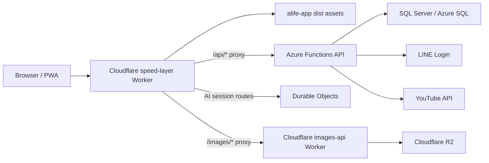

# Alife Alpha Architecture

## Overview

Alife is a full-stack community and church group platform with four main runtime areas:

- **Backend**: .NET 10 Azure Functions v4 isolated worker, ASP.NET Core controllers, MediatR, EF Core, SQL Server, HybridCache.
- **Frontend**: React 19 + TypeScript + Vite PWA, Tailwind CSS, TanStack Query, TanStack React DB, Axios, IndexedDB-backed ETag cache, browser WebAuthn, and local QR rendering.
- **Edge**: Cloudflare `speed-layer` Worker for frontend assets, API proxying, edge cache, authorization mirrors, and AI session Durable Objects.
- **Images**: separate Cloudflare `images-api` Worker backed by Cloudflare R2.

The current architecture is intentionally layered. The main product goal is alpha stability for real church/group usage while keeping the system maintainable enough for handover and portfolio review.

## Product Value Model

Alife reduces operational friction around church community life:

- Members can find groups, pages, sermons, events, notifications, and join flows from one mobile-friendly entry point.
- Leaders and co-leaders can manage subgroups, members, pages, and events without mixing management work into normal reading screens.
- Content volunteers can build bilingual pages from structured sections rather than editing code.
- Admins can run operational actions such as sermon sync and Cloudflare cache refresh from protected APIs.
- AI-assisted workflows help draft event planning, enrollment, and review content while leaving final persistence under user control.

### Primary Users

- **Guest**: can open onboarding, leave a visitor message, activate a pre-registered identity, or apply through a group QR without an account being created automatically.
- **Member**: can view accessible groups, pages, sermons, events, notifications, and enroll in activities.
- **Leader / CoLeader**: can manage approved groups, subgroups, memberships, pages, and events.
- **Admin**: can access protected admin operations.

## Runtime Topology



The speed layer is the normal browser-facing entry for deployed traffic. It serves the built React app, proxies origin API requests, routes AI session requests to Durable Objects, and handles cache/authorization mirror logic before falling back to the backend API.

## Backend Architecture

### Clean Architecture Layers

```text
Alife.Domain
  -> Alife.Application
  -> Alife.Infrastructure
  -> Alife.Api
```

- `Alife.Domain`: entities and enums with no infrastructure dependency.
- `Alife.Application`: commands, queries, DTOs, service interfaces, and use-case rules.
- `Alife.Infrastructure`: EF Core, migrations, SQL Server access, read services, cache invalidation, JWT, LINE, YouTube, Cloudflare integration.
- `Alife.Api`: Azure Functions host, ASP.NET Core HTTP pipeline, controllers, auth middleware, health checks, Swagger.
- `Alife.DbMigrator`: migration and seed runner.

The backend is controller-style HTTP API hosted inside Azure Functions, not a collection of isolated single-purpose scripts.

### Domain Model

Key entities:

- `Member`: display name, contact fields, LINE UID, random WebAuthn user handle, registration/admin state.
- `MemberPasskeyCredential`, `PasskeyCeremony`, and `OnboardingFlow`: public-key credentials, short-lived one-time ceremonies, and resumable intent context.
- `MemberActivationInvitation` and `ActivationGroupGrant`: one-time church pre-registration plus explicitly staged group roles.
- `GroupJoinInvite`, `ChurchPersonApplication`, `GroupMembershipApplication`, and `ApplicationHistory`: QR lifecycle and two-stage human approval records.
- `RateLimitBucket`: database-backed, HMAC-keyed anonymous security limits.
- `Group`: bilingual name/description JSON, hierarchy, access type, church/root marker, closed state.
- `GroupMembership`: member/group relationship with role and status.
- `Page`: the group-owned working page with bilingual title/description JSON, tags, visibility, and soft delete.
- `PagePublicationReview`: review state plus separate submitted and published JSON snapshots, including section-link metadata used by cards. Editing or returning a submitted copy never mutates the group working page or removes an existing published snapshot; explicitly changing page visibility away from public withdraws that published snapshot. `UpdatedUtc` is an optimistic concurrency token so simultaneous submit/review operations fail with a conflict instead of losing a copy.
- `Section`: ordered page block with type, content JSON, style JSON, and links.
- `Link`: section-owned links to groups/pages or external visual items.
- `Sermon`: synchronized YouTube sermon metadata.
- `GroupEvent`: group-owned event with bilingual titles and serialized rich event JSON.
- `EventEnrollment`: one enrollment per event/member, stored as JSON.
- `EventReview`: event review JSON; multiple reviews per event/member are allowed.
- `NotificationMessage`: recipient, creator, optional group/event context, action JSON, response JSON, read/reply timestamps.

### Enums And API Shape

The backend serializes enums as camelCase strings. The frontend normalizes legacy integer or string enum values where needed.

Important enums include:

- `AccessType`: public, protected, private.
- `MembershipStatus`: invited, requested, approved, rejected, removed.
- `MembershipRole`: member, coLeader, leader.
- `PageVisibility`: draft, group, public.
- `SectionType`: hero, rich text, spotlight, list view, and related section rendering types.

## Security Architecture

### Authentication

Alife uses Passkeys as the primary authenticator and stores the resulting JWT in the HttpOnly cookie `alife_auth`. LINE remains an explicit compatibility path. Internal Alpha access is configuration-whitelisted, absent from public navigation, and disabled unless explicitly enabled in the current environment.

Flow:

1. `/onboarding` creates a 30-minute server-side flow and retains only a validated same-site return path in a short-lived HttpOnly cookie.
2. A discoverable WebAuthn assertion validates RP ID, allowed origin, challenge, user verification, credential ownership, and signature count. The backend stores no biometric or device-PIN data.
3. Backend issues a JWT containing `sub`, `amr`, `auth_time`, and `session_kind`; public-device and Alpha cookies are non-persistent with shorter lifetimes.
4. JwtBearer middleware reads the JWT from the cookie and `CurrentMemberAccessor` resolves the current member.
5. Protected handlers perform current membership and role checks before mutations. Activation and application approval use one-time token consumption, optimistic concurrency, and idempotent membership/grant creation.

Activation, QR, and application-response URLs keep random secrets in the fragment. The browser removes the fragment before exchanging it in a request body; persistence stores only HMAC hashes. LINE OAuth state is single-use and bound to the server-side onboarding flow. The removed arbitrary display-name/phone login route returns `404`.

### Authorization

Group authorization is intentionally checked against current data instead of trusting stale role claims in the JWT.

Typical protected flow:

```text
HTTP request
  -> Cookie JWT validation
  -> Current member resolution
  -> Group membership/role check in application or read service
  -> Command/query execution
  -> Cache invalidation where needed
```

This is important because leaders and co-leaders can change membership state, and permission changes must take effect without waiting for token refresh.

## API Surface

Controllers are grouped by responsibility:

- `AuthController`: login, logout, dev/admin session.
- `PasskeysController`: discoverable authentication, registration, credential listing, and credential revocation.
- `OnboardingController`: flow resume, activation, group-invite resolution, application submission, and application replies.
- `IdentityManagementController`: activation administration, QR lifecycle, and church/group application decisions.
- `InternalAlphaLoginController`: server-supplied configuration whitelist and short non-persistent sessions; returns `404` when unavailable.
- `MembersController`: `/api/me`, LINE login/callback, explicit legacy LINE registration, and member listing.
- `GroupsController`: church root, group detail, subgroups, membership workflows, invite candidates, group update/close.
- `PagesController`: group pages, private working-copy detail, immutable published detail, create/update/submit/delete.
- `AdminController`: publication-copy preview/edit, approval/return, public menu management, sermon sync, and cache refresh.
- `EventsController`: group event list/create/update/delete.
- `EventEnrollmentsController`: enrollment list/create/update/delete.
- `EventReviewsController`: review list/create/update/delete.
- `NotificationsController`: notification list/create/reply/read.
- `SermonsController`: sermon listing.

Identity, token, visitor, application, task, and management responses are `no-store`; the Cloudflare and PWA layers must not cache them. Anonymous identity endpoints use SQL-backed HMAC-keyed limits and fail closed if the limiter is unavailable. `CF-Connecting-IP` is accepted only from configured trusted proxy networks.

Health and diagnostics:

- `GET /health/live`
- `GET /health/ready`
- `GET /health`
- `GET /api/swagger/v1/swagger.json`
- `GET /api/help`

## Caching Architecture

Alife has several cache layers, each with different privacy rules.

### Backend HybridCache

Backend read services use `.NET HybridCache` for read-heavy data:

- member profile data
- groups and memberships
- pages and sections
- events
- sermons

Write operations call invalidation services where applicable.

Public reads fail closed when a stored published snapshot is malformed or uses an unsupported version; they never fall back to unreviewed working content. The publication-snapshot migration also creates pending submitted copies for older public pages that did not yet have a review row.

### Cloudflare Speed Layer Cache

The speed layer uses the Cloudflare Cache API and logical cache records to support:

- public shared caching for `/api/sermons`, `/api/pages/public`, and `/api/pages/public/{pageId}` published snapshots;
- private, uncached working-copy reads at `/api/pages/{pageId}/working-copy`;
- authorized group-shared caching for group pages, subgroups, events, members, and memberships;
- uncached `/api/me` responses that may refresh only minimal group-membership authorization mirrors;
- generated ETags and `304 Not Modified`;
- passive invalidation after mutations;
- membership/page/entity metadata mirrors used to decide whether shared cached data can be read.

Browser-facing cacheable API responses are returned with private browser revalidation semantics such as `private, no-cache` and `Vary: Cookie, Authorization` where appropriate. `/api/me`, onboarding, credential, activation, application, visitor, internal Alpha, management, and personal-task responses use `no-store`. Public image responses can use public immutable-style caching.

### Frontend Cache

The frontend uses:

- TanStack Query for query coordination and invalidation.
- TanStack React DB collections for local list data.
- `idb-keyval` for ETag-aware `conditionalGet` storage in IndexedDB.
- Vite PWA runtime caching for app assets, images, fonts, and non-API runtime resources.

The PWA service worker deliberately avoids replaying `/api/*` responses from runtime cache. This protects users from seeing stale private data after auth or permission changes.

## Frontend Architecture

### Technology Stack

- React 19
- TypeScript
- Vite
- Tailwind CSS
- React Router 7
- Framer Motion
- Axios with `withCredentials`
- TanStack Query and TanStack React DB
- IndexedDB via `idb-keyval`
- Vite PWA

### Directory Structure

```text
cloudflare/alife-app/src/
  App.tsx                 App shell, route tree, navigation
  main.tsx                React root and providers
  stores/                 Auth, current group, leader UI preferences
  views/                  Route-level screens
  components/             Reusable UI and domain components
  services/               Axios-backed API clients and workflow clients
  api/                    Additional API helpers
  db/                     TanStack collections and ETag HTTP cache
  hooks/                  Screen/data composition hooks
  types/                  TypeScript DTO and model types
  i18n/                   UI text translation table
  utils/                  localization, enum normalization, page content helpers
```

### Key Frontend Flows

- `AuthProvider` bootstraps identity through `GET /api/me`.
- `CurrentGroupProvider` and `activeEntityService` keep the active group/page/event context stable across canonical and parameterized routes.
- `GroupDetailView` focuses on reading visible group content.
- `GroupManageView` owns group, subgroup, member, page, and event management.
- `PageEditorView` edits bilingual page metadata and structured sections.
- `EventCreatorView`, `EventEnrollmentView`, and `EventReviewView` cover event planning, enrollment, and review workflows.
- `NotificationToastHost` and notification services support action-oriented message flows.

## Page Builder And Bilingual Content

Pages use localized JSON fields for title and description. Sections use JSON payloads and explicit section types rather than storing raw whole-page HTML.

This supports:

- bilingual English/Chinese display;
- migration-friendly section evolution;
- content blocks such as hero, rich text, spotlight, and list-driven sections;
- list sections whose metadata can resolve sermons, groups, members, pages, or events through shared frontend data collections.

Visibility is explicit:

- `draft`: not broadly visible; privileged users or the creator can work on it.
- `group`: visible to approved members of the owner group.
- `public`: submits an isolated copy for publication review; it does not expose later working-page edits.

The group-owned working page, the submitted review copy, and the last approved public snapshot have separate lifecycles. A reviewer can revise or return the submitted copy without changing the group working page. If a newer submission is returned, the last approved snapshot remains on the public website until an explicit withdrawal, deletion, or later approval replaces it.

## AI Session Architecture

AI-assisted workflows run through the Cloudflare speed layer:

- generic AI router under `/api/ai`;
- event planning sessions under `/api/events/session/*`;
- enrollment sessions under `/api/enrollments/session/*`;
- review sessions under `/api/reviews/session/*`.

Durable Object classes:

- `EventPlanningSession`
- `EnrollmentSession`
- `ReviewSession`

The Durable Objects keep session state and call Gemini. Completed drafts are committed to backend REST APIs by the frontend, preserving the separation between temporary AI conversation state and durable business records.

## Image Architecture

`cloudflare/images-api` is a separate Worker that uses the `IMAGE_BUCKET` R2 binding.

It supports:

- `GET /api/images/config`
- `GET /api/images/list/{path}`
- `GET /api/images/{path}`
- `POST /api/images/{path}`
- `DELETE /api/images/{path}`
- `/help` and `/help/raw` for OpenAPI documentation

The Vite dev server proxies `/images/*` to the configured image origin. The deployed speed layer routes `/images/*` through the Worker pipeline and proxy handler.

## Deployment Architecture

### Local Development

- SQL Server runs through `backend/docker-compose.yml` on port `14333`.
- The API runs locally through `dotnet run --project backend/src/Alife.Api`.
- The frontend runs through Vite on `http://localhost:5173`.
- The speed layer can be tested through `npm run preview` from `cloudflare/alife-app`.

### Container Build

The backend `Dockerfile`:

- builds with `mcr.microsoft.com/dotnet/sdk:10.0`;
- publishes both `Alife.Api` and `Alife.DbMigrator`;
- runs on `mcr.microsoft.com/dotnet/aspnet:10.0-noble`;
- installs ICU for SQL Server globalization support;
- starts `dotnet Alife.Api.dll`.

It is a standard .NET publish/container flow, not Native AOT in the current project file.

### Cloudflare Deployment

`cloudflare/speed-layer/wrangler.jsonc`:

- serves built assets from `../alife-app/dist`;
- runs Worker code first for `/api/*` and `/images/*`;
- routes `ccalc.live`;
- configures Durable Object bindings and migrations;
- sets `API_PROXY_TARGET`;
- requires `GEMINI_API_KEY`.

`cloudflare/images-api/wrangler.toml`:

- routes `images.ccalc.live`;
- binds R2 buckets for image objects and help docs.

## Data Flow Examples

### User Opens The App

```text
Browser loads deployed domain
  -> speed-layer returns React assets
  -> app calls GET /api/me
  -> speed-layer may serve member cache or proxy to API
  -> API validates alife_auth cookie and resolves member
  -> frontend builds navigation from memberships and active group/page state
```

### Leader Submits A Group Page For Publication

```text
Leader opens group management
  -> frontend loads the private working copy
  -> leader edits the group-owned page and sections
  -> API validates leader/co-leader permission
  -> selecting public captures an immutable submitted snapshot for review
  -> a page reviewer previews or revises that submitted copy, then approves or returns it
  -> approval replaces the published snapshot and invalidates the public list/detail caches
  -> later working-page edits do not change the public website until another copy is approved
```

### Event Enrollment

```text
Member opens event enrollment route
  -> frontend restores or creates AI enrollment session
  -> Durable Object keeps chat/draft state
  -> user reviews and commits the draft
  -> frontend posts JSON to /api/events/{eventId}/enrollments
  -> backend enforces member/group access and stores the enrollment JSON
```

### Notification Reply

```text
Leader or workflow creates notification
  -> recipient sees notification through protected /api/notifications
  -> recipient posts reply JSON
  -> backend records ResponseDataJson and RepliedUtc
  -> response remains private and no-store/no-cache at API controller level
```

## Key Design Decisions

### 1. Minimal JWT In HttpOnly Cookie

This reduces frontend token exposure and avoids stale role claims. The trade-off is that group authorization requires current backend data or edge authorization mirrors.

### 2. Route-Level Management Workflows

Group reading and group management are separated. This keeps member browsing simpler and gives leaders a task-focused management route.

### 3. Structured Page Content

Pages are section-based and bilingual. This is more maintainable than storing raw HTML and supports future schema evolution.

### 4. Separate AI Session State From Durable Data

Durable Objects hold temporary conversation state. Backend APIs persist reviewed event/enrollment/review records.

### 5. Multi-Layer Cache With Privacy Boundaries

Public, group-shared, member-specific, and local browser caches are treated differently. Shared cache reads require explicit authorization context or public-safe routes.

## Testing Strategy

### Current Test Locations

- Backend unit tests: `backend/tests/Alife.Tests.Unit`
- Speed layer tests: `cloudflare/speed-layer/index.test.mjs`
- Images API tests: `cloudflare/images-api/worker/index.test.mjs`

### Useful Verification Commands

```powershell
dotnet build backend/Alife.sln -c Debug
dotnet test backend/tests/Alife.Tests.Unit/Alife.Tests.Unit.csproj -c Debug

cd cloudflare/alife-app
npm run build

cd ../speed-layer
npm test
```

### Future Gaps

- Broader API integration tests with a test database.
- Browser-level tests for onboarding, group management, page editing, and event enrollment/review.
- Explicit cache header regression tests for protected group/member data.
