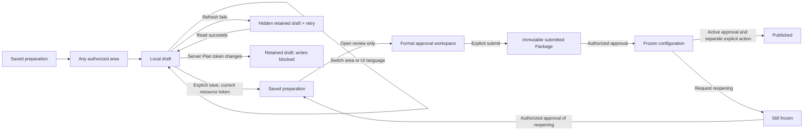

# Saved preparation: editorial workspace

## Scope and design decision

On 2026-09-22 the user selected **建筑杂志感：明亮、精致、留白与空间层次** and authorized continued local implementation. This is a bounded successor to the saved-preparation Prism Glass overview, not a replacement of the global shell, creation flow or every specialist editor. The shared creation overview keeps its existing material. No image, video, remote font, library or paid service is required.

The owner's job is to see the gathering's context, enter any preparation area, retain unfinished work and move explicitly to approval. Warm paper (`#fffdf8`), green-black ink (`#18332d`), muted green-gray (`#596a63`) and a dark green handover region (`#233e35`) carry the hierarchy. Existing domain colours remain on the area symbols and selected regions. Real dates, saved blocker counts and local draft/confirmation states are the content; decorative progress percentages are not used.

## Page wireframe

```text
Existing Alife navigation — unchanged
Back to event / workspace
Event title · preparation context
Preparation | Published | Delivery | Follow-up
Details · Overview · Plan review · Approval · Poster · Publish
Saved/frozen/unsaved status
Sticky explicit save actions (below application header)

Overview only:
Compact event brief / local date + approval review entry
Preparation areas                         Related / all
Domain entries: identity · enabled · draft · confirmation
Saved blockers (disclosure)

Focused editor (replaces the overview):
Back to overview                          Current area selector
Selected existing editor; other visited drafts stay mounted, hidden
```

Desktop uses a compact asymmetric brief/review spread and four-column domain index. Phone widths put the two-column area index before the supplementary brief/review regions. The four stages remain visible together; the secondary preparation-tool rail scrolls without wrapping and reveals the selected tool when it changes. Approval uses the existing authorized Package/assessment/reopening panels. Frozen routes keep the existing explicit reopening boundary; the new overview does not expose frozen editors. Non-owner work remains on the role-specific work routes.

### Usability correction after user review

#### Header and loading refinement

The header is now one warm-paper masthead rather than a large title followed by two visually competing underline rails. Four equal-width icon/label segments identify the lifecycle stage; subordinate preparation tools use a quieter selected surface. The title and stage rail share a row only when the content container has enough space. All four stages remain visible at 320px. Flow explanations sit in an explicit disclosure; locked tools retain readable labels and a visible approval prerequisite.

Initial preparation reads show a static, accessible workspace skeleton. The back-to-top footer is absent until content has loaded; background refresh retains existing records and drafts with a compact status. No authorization, API, publication or save boundary changes are introduced.

Evidence: zh/en browser fixtures passed at 320/390/1024/1280px, including delayed initial loading, stage visibility, flow disclosure and existing save/recovery/frozen checks. Additional selected/disabled navigation contrast samples passed at 390/1024px (minimum 4.69:1); this is not a full application accessibility audit. Affected-view TypeScript passed. Desktop and phone masthead/loading screenshots were visually inspected; artifacts are under `C:\Data\Alife\Temp\event-preparation-header-20260922`. These intercepted-API fixtures do not verify real accounts, backend integration or deployment.

#### Actionable workflow refinement

The subsequent entry/approval review replaces ambiguous “Edit / RAM” language with “Continue preparation” and names the enclosing four-stage surface “Event workspace”. Approval now prioritizes state, explicit actions and grouped outstanding items. Trial observations are separate from effective server denial; raw diagnostic codes, policy explanations and full evidence use disclosures. Missing approval is not repeated for every lifecycle gate. Module-specific gaps and evidence sections link to their allowlisted preparation editor and provide a saved-changes return to approval.

Optional temporary approval delegation uses member-name search/selection, explicit event scope, a named time zone, future expiry and confirmation. Only Event-local grants appear in the revocable list. Membership read failure is actionable and does not reveal an ID-entry fallback. The directory is not a server-certified eligible-approver list; the existing server remains authoritative.

Fixture screenshots for this refinement are under `C:\Data\Alife\Temp\event-action-guidance-20260922`. Browser coverage and limitations are recorded in current status. No new media, provider, backend contract or deployment is implied. This refines the shared action path, not every specialist editor's internal form.

The initial integrated screen was too tall and opening a desktop area placed its editor below the entire overview without revealing it. The compact revision removes promotional headings and long always-visible explanatory copy. Area selection now updates the compatible `module` bookmark and shows a focused editor in place of the overview. Back, the area selector, browser history and Overview navigation retain mounted drafts. Overview navigation clears the previous module parameter, so it actually closes the selected area.

Save actions sit in a sticky top bar rather than below the page. The scroll target includes the editor's back/select controls and accounts for the actual savebar height, including wrapped mobile pending-change text. Scrolling an editor must not horizontally pan the document. Unchanged arrangement drafts cannot submit redundant accepts. Leaving via the event/workspace/current-task return links asks for explicit discard when edits are pending; cancelling preserves them. This is a guard on these workspace links, not a claim of application-wide browser-close protection.

The compact revision was checked in zh/en at 320/390/1024/1280px, with explicit assertions for visible editor headings, unobscured back buttons, sticky save actions, no sideways document panning, clearing the module bookmark, area switching, history navigation and cancellation of discard. The existing creation-to-saved/AI-details regression also passed at 320/1280px in both languages. The focused 14 unit tests, Event-scoped TypeScript check and documentation check passed. Live backend authorization and deployment were not rerun for this UI-only correction.

With the same synthetic Chinese fixture, full-page overview captures reduced from 1804px to 1175px at 1280px width (35%) and from 2713px to 1493px at 320px width (45%). These are fixture measurements, not guarantees for arbitrarily long titles or module lists. The desktop related-domain entries fit the initial 900px-high viewport; on phones domains precede the supplementary brief. Current compact screenshots are under `C:\Data\Alife\Temp\event-preparation-compact-20260922`, including viewport-only `editor-{language}-{width}.png` captures. Full-page captures include the actual fixed mobile navigation/diagnostic overlay; long specialist forms still scroll, while the top save actions remain accessible.

## State transitions



The arrows summarize the presentation, not a replacement lifecycle contract. Source edits before formal approval still require fresh Package submission. Approval validity, conditions, publication, opening registration and execution confirmation remain independent server checks. See [Package approval](../EVENT-PACKAGE-APPROVAL.md).

## MVP interface contract: reuse, not a new API

The prototype's optional aggregate endpoint is **not implemented or required** for this slice. The UI projects the existing authenticated responses. Exact DTOs remain in the services/types and [machine contract](../event-contract.json); no payload, enum, persistence or cache contract changes here.

| Purpose | Existing operation | Boundary |
| --- | --- | --- |
| Authorized overview and saved readiness | `GET /api/events/{eventId}/workspace` | Only returned items/data; no private specialist details added |
| Accepted immutable Plan and token | `GET /api/events/{eventId}/plan` | Local confirmations never become approval |
| Edit/freeze authority | `GET /api/events/{eventId}/preparation` | Fail closed; retry retains the mounted draft |
| Event/occurrence context | Existing group Event read, occurrences and preparation arrangements | Existing owner/manager authorization and timezone conversion |
| Brief save | `PUT /api/events/{eventId}` | Existing Event update token; preserve bilingual and unrelated JSON |
| Plan preview / acceptance | Existing `plan/recompose` and `plan/accept` | Preview is not persistence; acceptance remains explicit, token-checked and idempotent |
| Reports, roles, RAM and registration rules | Existing module services | Resource-specific authority, tokens and human decisions stay inside each editor |
| Package review and downstream actions | Existing Package/assessment/lifecycle services | Opening the review does not generate, submit, approve or publish |

Protected responses remain private/no-store. No shared cache or new aggregate ETag is introduced. A missing `checkedUtc` is rendered as unknown, not zero blockers or successful approval. A known zero blocker count still does not confer approval. Visible local confirmations say “Details confirmed / 填写已确认”.

## Verification and limits

The maintained fixture entry is `ALIFE_QA_EDITORIAL_ONLY=1 node tests/eventSetupFlow.browser.cjs`, with the existing browser/module/base-URL environment variables. It uses synthetic events and intercepts API calls; it does not create real events or prove production authorization.

The checks cover zh/en at 320/390/1024/1280px, horizontal overflow, four-stage navigation, related/all filtering, keyboard focus, reduced motion, local drafts across domains/language, no language-only refetch, explicit bilingual saves with unrelated JSON preservation, failed-read recovery, changed Plan tokens, read-only details, frozen routes and absence of implicit publication. Current screenshots are disposable local outputs under `C:\Data\Alife\Temp\event-preparation-editorial-20260922`.

User acceptance of the integrated visual, live provider/database verification, specialist interior redesign and deployment are separate. Existing older full-flow fixture branches have stale wizard/registration assumptions; their results are not claimed by the editorial checks.

### Local evidence, 2026-09-22

- Editorial browser matrix: 8 passes (zh/en × 320/390/1024/1280px), with zero page exceptions. Each case deliberately returns one preparation-read 503 to exercise recovery. Opaque domain/handover text and both brief-gradient endpoints sample at a minimum 5.04:1 contrast. This is a bounded sample, not a complete application contrast audit.
- Existing `ALIFE_QA_DETAILS_ONLY=1` creation-to-saved regression: 4 passes (zh/en × 320/1280px), including manual/AI draft retention, explicit save, legacy saved links, managed registration capacity and read-only/frozen boundaries. The changed navigation assertions have been updated; specialist full-flow fixtures are not claimed.
- Focused setup-flow, saved-preparation and creation-arrangement unit suites: 14 tests passed.
- Event entry and transitive dependencies: scoped TypeScript check passed. Full application typecheck encountered unrelated `src/views/virtualChurchSharedMotion.ts:9` TS1294 in the concurrently edited Virtual Church area; no repair to that file was attempted.
- Vite production bundle generation passed to the task's external `bundle` directory with `copyPublicDir: false`. This validates compilation/bundling, not a complete deployable asset package. Existing large-chunk/idb-keyval warnings remain.
- Documentation generation/check and scoped `git diff --check` passed. The initial freshness failure was resolved by the normal generator; generated HTML has no substantive Git diff.

Desktop zh/1280, en/1024 and phone zh/320 screenshots were visually inspected. The 1024px layout uses available content width rather than viewport width, so the existing sidebar cannot squeeze the brief/approval spread into narrow columns. Screenshots retain the actual shell and development cache-inspector overlay. No Git publication or deployment was performed.
